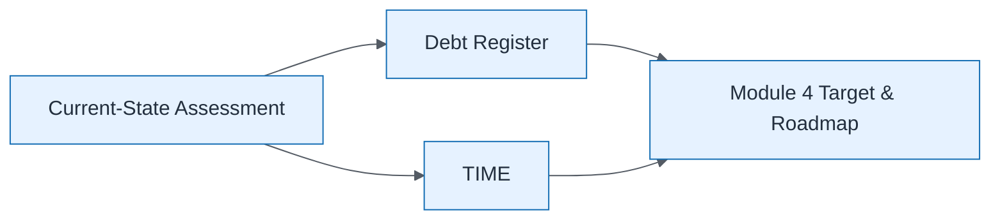

# Assessment to Roadmap Handoff

| Field | Value |
| ----- | ----- |
| ID | `m03-process-assessment-to-roadmap-handoff` |
| Category | `process` |
| Module | `module-03` |
| Lesson | 3.4 |
| Lab | lab-03 |
| Learning objective | Assess current estate: Assessment to Roadmap Handoff |
| AWS icons | _None (non-AWS concept)_ |

## Formats

- Mermaid: [`module-03/mermaid/process/m03-process-assessment-to-roadmap-handoff.mmd`](module-03/mermaid/process/m03-process-assessment-to-roadmap-handoff.mmd)
- Draw.io: [`module-03/drawio/process/m03-process-assessment-to-roadmap-handoff.drawio`](module-03/drawio/process/m03-process-assessment-to-roadmap-handoff.drawio)
- SVG: [`module-03/svg/process/m03-process-assessment-to-roadmap-handoff.svg`](module-03/svg/process/m03-process-assessment-to-roadmap-handoff.svg)
- PNG: [`module-03/png/process/m03-process-assessment-to-roadmap-handoff.png`](module-03/png/process/m03-process-assessment-to-roadmap-handoff.png)

## Mermaid

> Presentation masters for AWS reference architectures should be refined in Draw.io using official **AWS Architecture Icons** (AWS19/AWS23 stencil). Mermaid preserves structure and learning intent.
