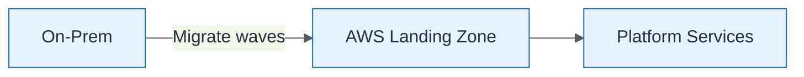

# Cloud Migration Context

| Field | Value |
| ----- | ----- |
| ID | `m04-aws-cloud-migration-context` |
| Category | `aws` |
| Module | `module-04` |
| Lesson | 4.3 |
| Lab | lab-04 |
| Learning objective | Design target-state: Cloud Migration Context |
| AWS icons | AWS Organizations, IAM |

## Formats

- Mermaid: [`module-04/mermaid/aws/m04-aws-cloud-migration-context.mmd`](module-04/mermaid/aws/m04-aws-cloud-migration-context.mmd)
- Draw.io: [`module-04/drawio/aws/m04-aws-cloud-migration-context.drawio`](module-04/drawio/aws/m04-aws-cloud-migration-context.drawio)
- SVG: [`module-04/svg/aws/m04-aws-cloud-migration-context.svg`](module-04/svg/aws/m04-aws-cloud-migration-context.svg)
- PNG: [`module-04/png/aws/m04-aws-cloud-migration-context.png`](module-04/png/aws/m04-aws-cloud-migration-context.png)

## Mermaid

> Presentation masters for AWS reference architectures should be refined in Draw.io using official **AWS Architecture Icons** (AWS19/AWS23 stencil). Mermaid preserves structure and learning intent.
