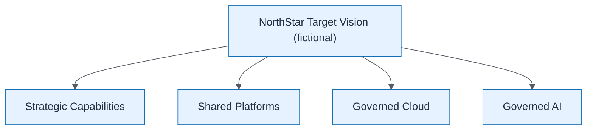

# Target State Vision

| Field | Value |
| ----- | ----- |
| ID | `m04-executive-target-state-vision` |
| Category | `executive` |
| Module | `module-04` |
| Lesson | 4.1 |
| Lab | lab-04 |
| Learning objective | Design target-state: Target State Vision |
| AWS icons | _None (non-AWS concept)_ |

## Formats

- Mermaid: [`module-04/mermaid/executive/m04-executive-target-state-vision.mmd`](module-04/mermaid/executive/m04-executive-target-state-vision.mmd)
- Draw.io: [`module-04/drawio/executive/m04-executive-target-state-vision.drawio`](module-04/drawio/executive/m04-executive-target-state-vision.drawio)
- SVG: [`module-04/svg/executive/m04-executive-target-state-vision.svg`](module-04/svg/executive/m04-executive-target-state-vision.svg)
- PNG: [`module-04/png/executive/m04-executive-target-state-vision.png`](module-04/png/executive/m04-executive-target-state-vision.png)

## Mermaid

> Presentation masters for AWS reference architectures should be refined in Draw.io using official **AWS Architecture Icons** (AWS19/AWS23 stencil). Mermaid preserves structure and learning intent.
