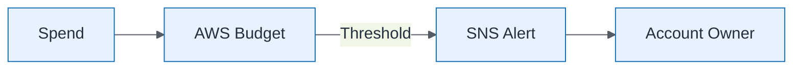

# Budget Alert Flow

| Field | Value |
| ----- | ----- |
| ID | `m05-aws-budget-alert-flow` |
| Category | `aws` |
| Module | `module-05` |
| Lesson | 5.1 |
| Lab | lab-05 |
| Learning objective | Cloud/platform strategy: Budget Alert Flow |
| AWS icons | AWS Budgets, Amazon SNS |

## Formats

- Mermaid: [`module-05/mermaid/aws/m05-aws-budget-alert-flow.mmd`](module-05/mermaid/aws/m05-aws-budget-alert-flow.mmd)
- Draw.io: [`module-05/drawio/aws/m05-aws-budget-alert-flow.drawio`](module-05/drawio/aws/m05-aws-budget-alert-flow.drawio)
- SVG: [`module-05/svg/aws/m05-aws-budget-alert-flow.svg`](module-05/svg/aws/m05-aws-budget-alert-flow.svg)
- PNG: [`module-05/png/aws/m05-aws-budget-alert-flow.png`](module-05/png/aws/m05-aws-budget-alert-flow.png)

## Mermaid

> Presentation masters for AWS reference architectures should be refined in Draw.io using official **AWS Architecture Icons** (AWS19/AWS23 stencil). Mermaid preserves structure and learning intent.
