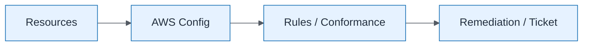

# Config Conformance Pack Concept

| Field | Value |
| ----- | ----- |
| ID | `m05-aws-config-conformance-pack-concept` |
| Category | `aws` |
| Module | `module-05` |
| Lesson | 5.3 |
| Lab | lab-05 |
| Learning objective | Cloud/platform strategy: Config Conformance Pack Concept |
| AWS icons | AWS Config |

## Formats

- Mermaid: [`module-05/mermaid/aws/m05-aws-config-conformance-pack-concept.mmd`](module-05/mermaid/aws/m05-aws-config-conformance-pack-concept.mmd)
- Draw.io: [`module-05/drawio/aws/m05-aws-config-conformance-pack-concept.drawio`](module-05/drawio/aws/m05-aws-config-conformance-pack-concept.drawio)
- SVG: [`module-05/svg/aws/m05-aws-config-conformance-pack-concept.svg`](module-05/svg/aws/m05-aws-config-conformance-pack-concept.svg)
- PNG: [`module-05/png/aws/m05-aws-config-conformance-pack-concept.png`](module-05/png/aws/m05-aws-config-conformance-pack-concept.png)

## Mermaid

> Presentation masters for AWS reference architectures should be refined in Draw.io using official **AWS Architecture Icons** (AWS19/AWS23 stencil). Mermaid preserves structure and learning intent.
