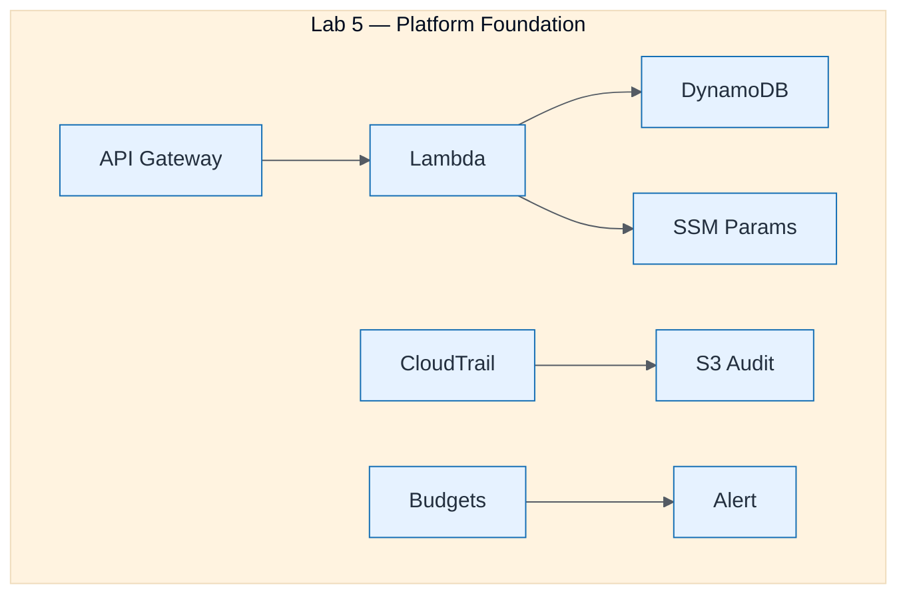

# Lab 5 Platform Foundation

| Field | Value |
| ----- | ----- |
| ID | `m05-aws-lab-5-platform-foundation` |
| Category | `aws` |
| Module | `module-05` |
| Lesson | 5.2 |
| Lab | lab-05 |
| Learning objective | Cloud/platform strategy: Lab 5 Platform Foundation |
| AWS icons | IAM, Amazon S3, AWS CloudTrail, Amazon CloudWatch, AWS Budgets, Amazon DynamoDB, AWS Lambda, Amazon API Gateway, AWS Systems Manager |

## Formats

- Mermaid: [`module-05/mermaid/aws/m05-aws-lab-5-platform-foundation.mmd`](module-05/mermaid/aws/m05-aws-lab-5-platform-foundation.mmd)
- Draw.io: [`module-05/drawio/aws/m05-aws-lab-5-platform-foundation.drawio`](module-05/drawio/aws/m05-aws-lab-5-platform-foundation.drawio)
- SVG: [`module-05/svg/aws/m05-aws-lab-5-platform-foundation.svg`](module-05/svg/aws/m05-aws-lab-5-platform-foundation.svg)
- PNG: [`module-05/png/aws/m05-aws-lab-5-platform-foundation.png`](module-05/png/aws/m05-aws-lab-5-platform-foundation.png)

## Mermaid

> Presentation masters for AWS reference architectures should be refined in Draw.io using official **AWS Architecture Icons** (AWS19/AWS23 stencil). Mermaid preserves structure and learning intent.
