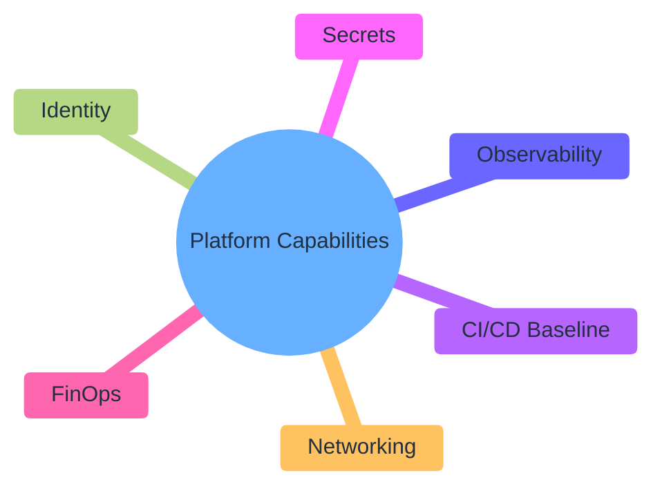

# Platform Capability Map

| Field | Value |
| ----- | ----- |
| ID | `m05-concept-platform-capability-map` |
| Category | `concept` |
| Module | `module-05` |
| Lesson | 5.4 |
| Lab | lab-05 |
| Learning objective | Cloud/platform strategy: Platform Capability Map |
| AWS icons | _None (non-AWS concept)_ |

## Formats

- Mermaid: [`module-05/mermaid/concept/m05-concept-platform-capability-map.mmd`](module-05/mermaid/concept/m05-concept-platform-capability-map.mmd)
- Draw.io: [`module-05/drawio/concept/m05-concept-platform-capability-map.drawio`](module-05/drawio/concept/m05-concept-platform-capability-map.drawio)
- SVG: [`module-05/svg/concept/m05-concept-platform-capability-map.svg`](module-05/svg/concept/m05-concept-platform-capability-map.svg)
- PNG: [`module-05/png/concept/m05-concept-platform-capability-map.png`](module-05/png/concept/m05-concept-platform-capability-map.png)

## Mermaid

> Presentation masters for AWS reference architectures should be refined in Draw.io using official **AWS Architecture Icons** (AWS19/AWS23 stencil). Mermaid preserves structure and learning intent.
