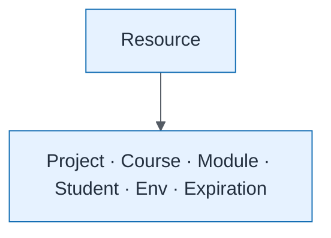

# Tagging Standard Model

| Field | Value |
| ----- | ----- |
| ID | `m05-concept-tagging-standard-model` |
| Category | `concept` |
| Module | `module-05` |
| Lesson | 5.4 |
| Lab | lab-05 |
| Learning objective | Cloud/platform strategy: Tagging Standard Model |
| AWS icons | AWS Budgets |

## Formats

- Mermaid: [`module-05/mermaid/concept/m05-concept-tagging-standard-model.mmd`](module-05/mermaid/concept/m05-concept-tagging-standard-model.mmd)
- Draw.io: [`module-05/drawio/concept/m05-concept-tagging-standard-model.drawio`](module-05/drawio/concept/m05-concept-tagging-standard-model.drawio)
- SVG: [`module-05/svg/concept/m05-concept-tagging-standard-model.svg`](module-05/svg/concept/m05-concept-tagging-standard-model.svg)
- PNG: [`module-05/png/concept/m05-concept-tagging-standard-model.png`](module-05/png/concept/m05-concept-tagging-standard-model.png)

## Mermaid

> Presentation masters for AWS reference architectures should be refined in Draw.io using official **AWS Architecture Icons** (AWS19/AWS23 stencil). Mermaid preserves structure and learning intent.
