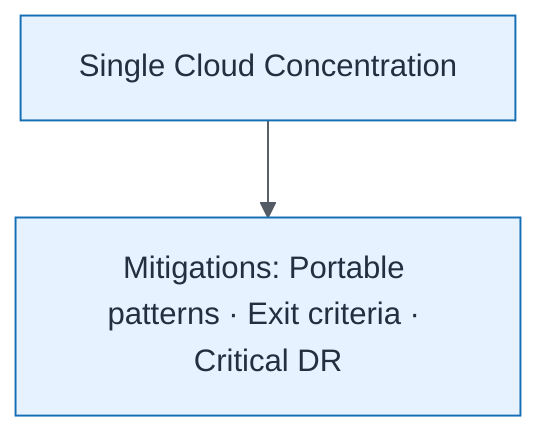

# Concentration Risk View

| Field | Value |
| ----- | ----- |
| ID | `m05-executive-concentration-risk-view` |
| Category | `executive` |
| Module | `module-05` |
| Lesson | 5.4 |
| Lab | lab-05 |
| Learning objective | Cloud/platform strategy: Concentration Risk View |
| AWS icons | _None (non-AWS concept)_ |

## Formats

- Mermaid: [`module-05/mermaid/executive/m05-executive-concentration-risk-view.mmd`](module-05/mermaid/executive/m05-executive-concentration-risk-view.mmd)
- Draw.io: [`module-05/drawio/executive/m05-executive-concentration-risk-view.drawio`](module-05/drawio/executive/m05-executive-concentration-risk-view.drawio)
- SVG: [`module-05/svg/executive/m05-executive-concentration-risk-view.svg`](module-05/svg/executive/m05-executive-concentration-risk-view.svg)
- PNG: [`module-05/png/executive/m05-executive-concentration-risk-view.png`](module-05/png/executive/m05-executive-concentration-risk-view.png)

## Mermaid

> Presentation masters for AWS reference architectures should be refined in Draw.io using official **AWS Architecture Icons** (AWS19/AWS23 stencil). Mermaid preserves structure and learning intent.
