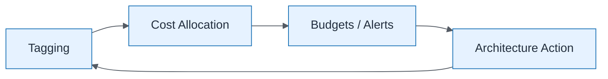

# FinOps Feedback Loop

| Field | Value |
| ----- | ----- |
| ID | `m05-executive-finops-feedback-loop` |
| Category | `executive` |
| Module | `module-05` |
| Lesson | 5.4 |
| Lab | lab-05 |
| Learning objective | Cloud/platform strategy: FinOps Feedback Loop |
| AWS icons | AWS Budgets, Amazon CloudWatch |

## Formats

- Mermaid: [`module-05/mermaid/executive/m05-executive-finops-feedback-loop.mmd`](module-05/mermaid/executive/m05-executive-finops-feedback-loop.mmd)
- Draw.io: [`module-05/drawio/executive/m05-executive-finops-feedback-loop.drawio`](module-05/drawio/executive/m05-executive-finops-feedback-loop.drawio)
- SVG: [`module-05/svg/executive/m05-executive-finops-feedback-loop.svg`](module-05/svg/executive/m05-executive-finops-feedback-loop.svg)
- PNG: [`module-05/png/executive/m05-executive-finops-feedback-loop.png`](module-05/png/executive/m05-executive-finops-feedback-loop.png)

## Mermaid

> Presentation masters for AWS reference architectures should be refined in Draw.io using official **AWS Architecture Icons** (AWS19/AWS23 stencil). Mermaid preserves structure and learning intent.
