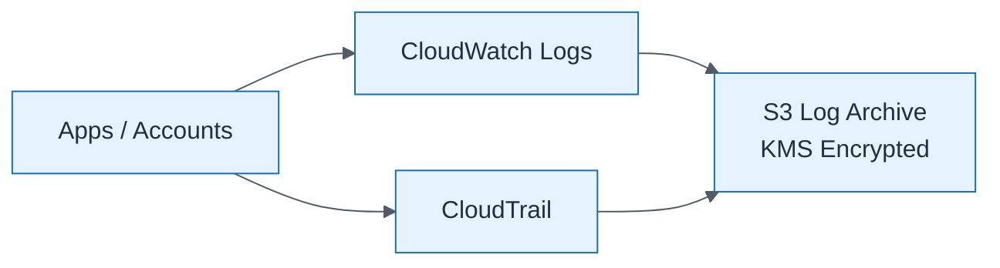

# Central Logging Architecture

| Field | Value |
| ----- | ----- |
| ID | `m05-infrastructure-central-logging-architecture` |
| Category | `infrastructure` |
| Module | `module-05` |
| Lesson | 5.3 |
| Lab | lab-05 |
| Learning objective | Cloud/platform strategy: Central Logging Architecture |
| AWS icons | Amazon S3, Amazon CloudWatch, AWS KMS |

## Formats

- Mermaid: [`module-05/mermaid/infrastructure/m05-infrastructure-central-logging-architecture.mmd`](module-05/mermaid/infrastructure/m05-infrastructure-central-logging-architecture.mmd)
- Draw.io: [`module-05/drawio/infrastructure/m05-infrastructure-central-logging-architecture.drawio`](module-05/drawio/infrastructure/m05-infrastructure-central-logging-architecture.drawio)
- SVG: [`module-05/svg/infrastructure/m05-infrastructure-central-logging-architecture.svg`](module-05/svg/infrastructure/m05-infrastructure-central-logging-architecture.svg)
- PNG: [`module-05/png/infrastructure/m05-infrastructure-central-logging-architecture.png`](module-05/png/infrastructure/m05-infrastructure-central-logging-architecture.png)

## Mermaid

> Presentation masters for AWS reference architectures should be refined in Draw.io using official **AWS Architecture Icons** (AWS19/AWS23 stencil). Mermaid preserves structure and learning intent.
