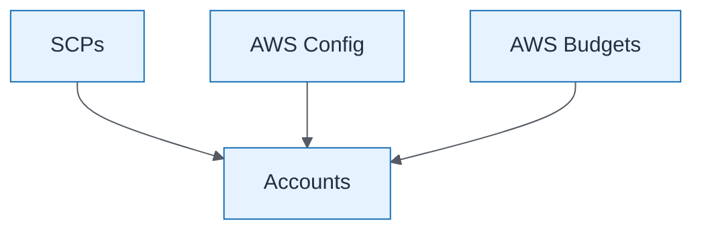

# Cloud Governance Guardrails

| Field | Value |
| ----- | ----- |
| ID | `m05-process-cloud-governance-guardrails` |
| Category | `process` |
| Module | `module-05` |
| Lesson | 5.3 |
| Lab | lab-05 |
| Learning objective | Cloud/platform strategy: Cloud Governance Guardrails |
| AWS icons | AWS Organizations, AWS Config, AWS Budgets |

## Formats

- Mermaid: [`module-05/mermaid/process/m05-process-cloud-governance-guardrails.mmd`](module-05/mermaid/process/m05-process-cloud-governance-guardrails.mmd)
- Draw.io: [`module-05/drawio/process/m05-process-cloud-governance-guardrails.drawio`](module-05/drawio/process/m05-process-cloud-governance-guardrails.drawio)
- SVG: [`module-05/svg/process/m05-process-cloud-governance-guardrails.svg`](module-05/svg/process/m05-process-cloud-governance-guardrails.svg)
- PNG: [`module-05/png/process/m05-process-cloud-governance-guardrails.png`](module-05/png/process/m05-process-cloud-governance-guardrails.png)

## Mermaid

> Presentation masters for AWS reference architectures should be refined in Draw.io using official **AWS Architecture Icons** (AWS19/AWS23 stencil). Mermaid preserves structure and learning intent.
