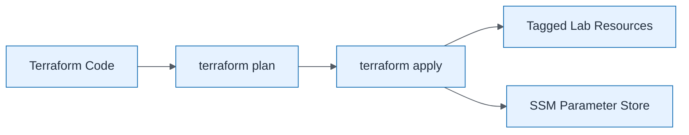

# Terraform Apply Flow

| Field | Value |
| ----- | ----- |
| ID | `m05-process-terraform-apply-flow` |
| Category | `process` |
| Module | `module-05` |
| Lesson | 5.4 |
| Lab | lab-05 |
| Learning objective | Cloud/platform strategy: Terraform Apply Flow |
| AWS icons | AWS Systems Manager |

## Formats

- Mermaid: [`module-05/mermaid/process/m05-process-terraform-apply-flow.mmd`](module-05/mermaid/process/m05-process-terraform-apply-flow.mmd)
- Draw.io: [`module-05/drawio/process/m05-process-terraform-apply-flow.drawio`](module-05/drawio/process/m05-process-terraform-apply-flow.drawio)
- SVG: [`module-05/svg/process/m05-process-terraform-apply-flow.svg`](module-05/svg/process/m05-process-terraform-apply-flow.svg)
- PNG: [`module-05/png/process/m05-process-terraform-apply-flow.png`](module-05/png/process/m05-process-terraform-apply-flow.png)

## Mermaid

> Presentation masters for AWS reference architectures should be refined in Draw.io using official **AWS Architecture Icons** (AWS19/AWS23 stencil). Mermaid preserves structure and learning intent.
