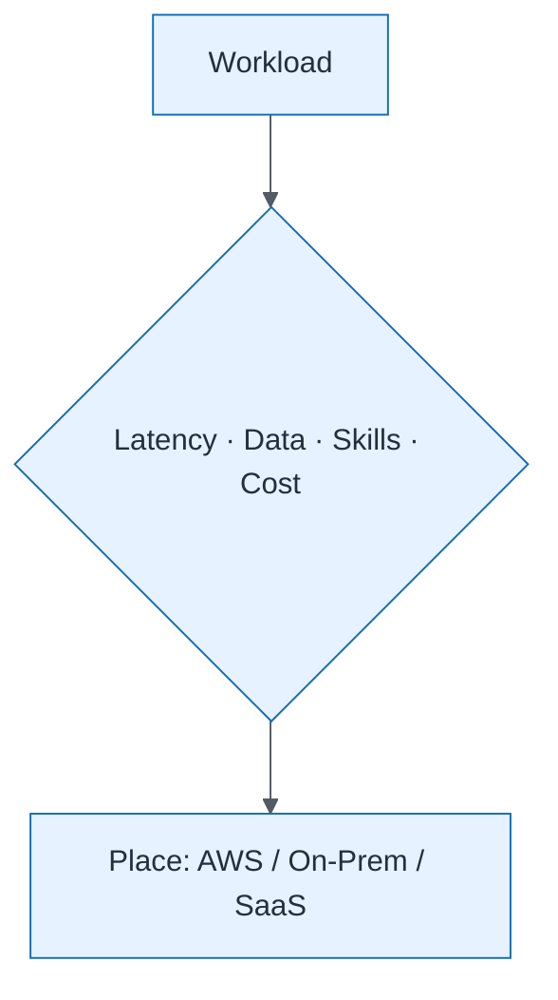

# Workload Placement Decision

| Field | Value |
| ----- | ----- |
| ID | `m05-process-workload-placement-decision` |
| Category | `process` |
| Module | `module-05` |
| Lesson | 5.1 |
| Lab | lab-05 |
| Learning objective | Cloud/platform strategy: Workload Placement Decision |
| AWS icons | _None (non-AWS concept)_ |

## Formats

- Mermaid: [`module-05/mermaid/process/m05-process-workload-placement-decision.mmd`](module-05/mermaid/process/m05-process-workload-placement-decision.mmd)
- Draw.io: [`module-05/drawio/process/m05-process-workload-placement-decision.drawio`](module-05/drawio/process/m05-process-workload-placement-decision.drawio)
- SVG: [`module-05/svg/process/m05-process-workload-placement-decision.svg`](module-05/svg/process/m05-process-workload-placement-decision.svg)
- PNG: [`module-05/png/process/m05-process-workload-placement-decision.png`](module-05/png/process/m05-process-workload-placement-decision.png)

## Mermaid

> Presentation masters for AWS reference architectures should be refined in Draw.io using official **AWS Architecture Icons** (AWS19/AWS23 stencil). Mermaid preserves structure and learning intent.
