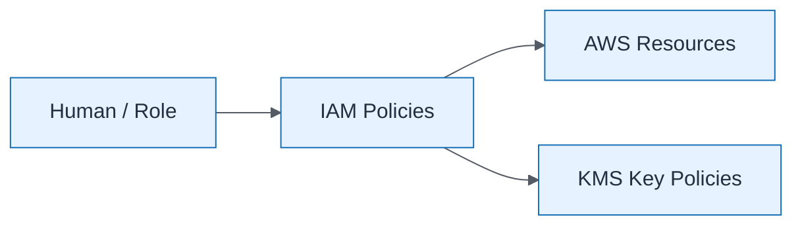

# IAM Least Privilege Pattern

| Field | Value |
| ----- | ----- |
| ID | `m05-security-iam-least-privilege-pattern` |
| Category | `security` |
| Module | `module-05` |
| Lesson | 5.1 |
| Lab | lab-05 |
| Learning objective | Cloud/platform strategy: IAM Least Privilege Pattern |
| AWS icons | IAM, AWS KMS |

## Formats

- Mermaid: [`module-05/mermaid/security/m05-security-iam-least-privilege-pattern.mmd`](module-05/mermaid/security/m05-security-iam-least-privilege-pattern.mmd)
- Draw.io: [`module-05/drawio/security/m05-security-iam-least-privilege-pattern.drawio`](module-05/drawio/security/m05-security-iam-least-privilege-pattern.drawio)
- SVG: [`module-05/svg/security/m05-security-iam-least-privilege-pattern.svg`](module-05/svg/security/m05-security-iam-least-privilege-pattern.svg)
- PNG: [`module-05/png/security/m05-security-iam-least-privilege-pattern.png`](module-05/png/security/m05-security-iam-least-privilege-pattern.png)

## Mermaid

> Presentation masters for AWS reference architectures should be refined in Draw.io using official **AWS Architecture Icons** (AWS19/AWS23 stencil). Mermaid preserves structure and learning intent.
