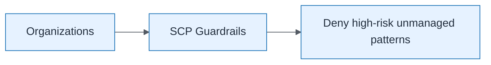

# SCP Deny Dangerous Services

| Field | Value |
| ----- | ----- |
| ID | `m05-security-scp-deny-dangerous-services` |
| Category | `security` |
| Module | `module-05` |
| Lesson | 5.2 |
| Lab | lab-05 |
| Learning objective | Cloud/platform strategy: SCP Deny Dangerous Services |
| AWS icons | AWS Organizations |

## Formats

- Mermaid: [`module-05/mermaid/security/m05-security-scp-deny-dangerous-services.mmd`](module-05/mermaid/security/m05-security-scp-deny-dangerous-services.mmd)
- Draw.io: [`module-05/drawio/security/m05-security-scp-deny-dangerous-services.drawio`](module-05/drawio/security/m05-security-scp-deny-dangerous-services.drawio)
- SVG: [`module-05/svg/security/m05-security-scp-deny-dangerous-services.svg`](module-05/svg/security/m05-security-scp-deny-dangerous-services.svg)
- PNG: [`module-05/png/security/m05-security-scp-deny-dangerous-services.png`](module-05/png/security/m05-security-scp-deny-dangerous-services.png)

## Mermaid

> Presentation masters for AWS reference architectures should be refined in Draw.io using official **AWS Architecture Icons** (AWS19/AWS23 stencil). Mermaid preserves structure and learning intent.
