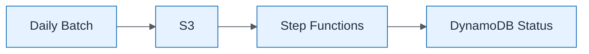

# Batch Regulatory Pipeline

| Field | Value |
| ----- | ----- |
| ID | `m06-aws-batch-regulatory-pipeline` |
| Category | `aws` |
| Module | `module-06` |
| Lesson | 6.1 |
| Lab | lab-06 |
| Learning objective | Integration/data architecture: Batch Regulatory Pipeline |
| AWS icons | Amazon S3, AWS Step Functions, Amazon DynamoDB |

## Formats

- Mermaid: [`module-06/mermaid/aws/m06-aws-batch-regulatory-pipeline.mmd`](module-06/mermaid/aws/m06-aws-batch-regulatory-pipeline.mmd)
- Draw.io: [`module-06/drawio/aws/m06-aws-batch-regulatory-pipeline.drawio`](module-06/drawio/aws/m06-aws-batch-regulatory-pipeline.drawio)
- SVG: [`module-06/svg/aws/m06-aws-batch-regulatory-pipeline.svg`](module-06/svg/aws/m06-aws-batch-regulatory-pipeline.svg)
- PNG: [`module-06/png/aws/m06-aws-batch-regulatory-pipeline.png`](module-06/png/aws/m06-aws-batch-regulatory-pipeline.png)

## Mermaid

> Presentation masters for AWS reference architectures should be refined in Draw.io using official **AWS Architecture Icons** (AWS19/AWS23 stencil). Mermaid preserves structure and learning intent.
