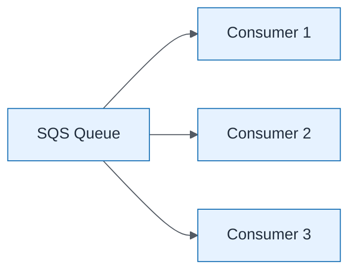

# SQS Competing Consumers

| Field | Value |
| ----- | ----- |
| ID | `m06-aws-sqs-competing-consumers` |
| Category | `aws` |
| Module | `module-06` |
| Lesson | 6.1 |
| Lab | lab-06 |
| Learning objective | Integration/data architecture: SQS Competing Consumers |
| AWS icons | Amazon SQS, AWS Lambda |

## Formats

- Mermaid: [`module-06/mermaid/aws/m06-aws-sqs-competing-consumers.mmd`](module-06/mermaid/aws/m06-aws-sqs-competing-consumers.mmd)
- Draw.io: [`module-06/drawio/aws/m06-aws-sqs-competing-consumers.drawio`](module-06/drawio/aws/m06-aws-sqs-competing-consumers.drawio)
- SVG: [`module-06/svg/aws/m06-aws-sqs-competing-consumers.svg`](module-06/svg/aws/m06-aws-sqs-competing-consumers.svg)
- PNG: [`module-06/png/aws/m06-aws-sqs-competing-consumers.png`](module-06/png/aws/m06-aws-sqs-competing-consumers.png)

## Mermaid

> Presentation masters for AWS reference architectures should be refined in Draw.io using official **AWS Architecture Icons** (AWS19/AWS23 stencil). Mermaid preserves structure and learning intent.
