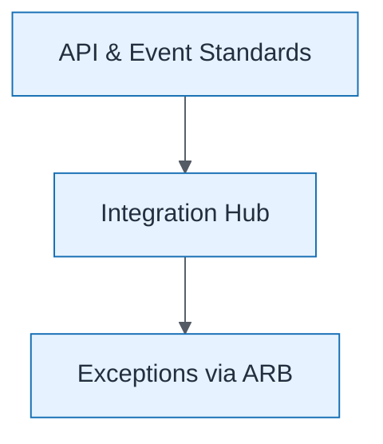

# Integration Governance Overlay

| Field | Value |
| ----- | ----- |
| ID | `m06-concept-integration-governance-overlay` |
| Category | `concept` |
| Module | `module-06` |
| Lesson | 6.1 |
| Lab | lab-06 |
| Learning objective | Integration/data architecture: Integration Governance Overlay |
| AWS icons | _None (non-AWS concept)_ |

## Formats

- Mermaid: [`module-06/mermaid/concept/m06-concept-integration-governance-overlay.mmd`](module-06/mermaid/concept/m06-concept-integration-governance-overlay.mmd)
- Draw.io: [`module-06/drawio/concept/m06-concept-integration-governance-overlay.drawio`](module-06/drawio/concept/m06-concept-integration-governance-overlay.drawio)
- SVG: [`module-06/svg/concept/m06-concept-integration-governance-overlay.svg`](module-06/svg/concept/m06-concept-integration-governance-overlay.svg)
- PNG: [`module-06/png/concept/m06-concept-integration-governance-overlay.png`](module-06/png/concept/m06-concept-integration-governance-overlay.png)

## Mermaid

> Presentation masters for AWS reference architectures should be refined in Draw.io using official **AWS Architecture Icons** (AWS19/AWS23 stencil). Mermaid preserves structure and learning intent.
