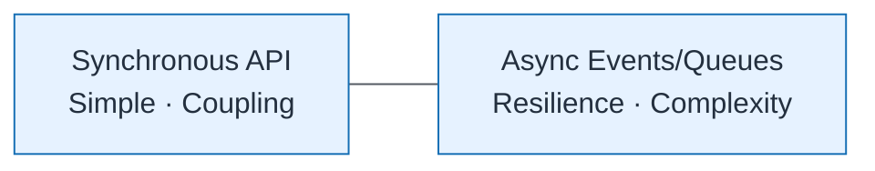

# Sync vs Async Trade-offs

| Field | Value |
| ----- | ----- |
| ID | `m06-concept-sync-vs-async-trade-offs` |
| Category | `concept` |
| Module | `module-06` |
| Lesson | 6.3 |
| Lab | lab-06 |
| Learning objective | Integration/data architecture: Sync vs Async Trade-offs |
| AWS icons | _None (non-AWS concept)_ |

## Formats

- Mermaid: [`module-06/mermaid/concept/m06-concept-sync-vs-async-trade-offs.mmd`](module-06/mermaid/concept/m06-concept-sync-vs-async-trade-offs.mmd)
- Draw.io: [`module-06/drawio/concept/m06-concept-sync-vs-async-trade-offs.drawio`](module-06/drawio/concept/m06-concept-sync-vs-async-trade-offs.drawio)
- SVG: [`module-06/svg/concept/m06-concept-sync-vs-async-trade-offs.svg`](module-06/svg/concept/m06-concept-sync-vs-async-trade-offs.svg)
- PNG: [`module-06/png/concept/m06-concept-sync-vs-async-trade-offs.png`](module-06/png/concept/m06-concept-sync-vs-async-trade-offs.png)

## Mermaid

> Presentation masters for AWS reference architectures should be refined in Draw.io using official **AWS Architecture Icons** (AWS19/AWS23 stencil). Mermaid preserves structure and learning intent.
