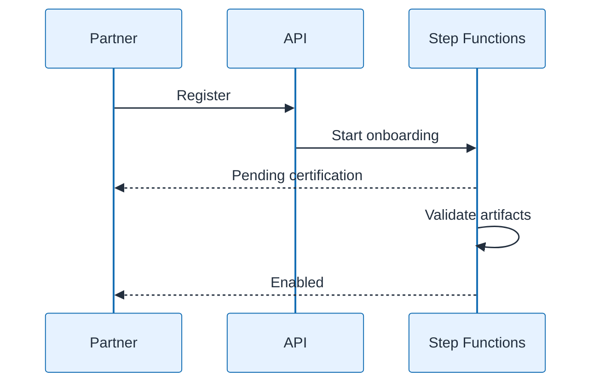

# Partner Onboarding Sequence

| Field | Value |
| ----- | ----- |
| ID | `m06-sequence-partner-onboarding-sequence` |
| Category | `sequence` |
| Module | `module-06` |
| Lesson | 6.1 |
| Lab | lab-06 |
| Learning objective | Integration/data architecture: Partner Onboarding Sequence |
| AWS icons | Amazon API Gateway, AWS Step Functions |

## Formats

- Mermaid: [`module-06/mermaid/sequence/m06-sequence-partner-onboarding-sequence.mmd`](module-06/mermaid/sequence/m06-sequence-partner-onboarding-sequence.mmd)
- Draw.io: [`module-06/drawio/sequence/m06-sequence-partner-onboarding-sequence.drawio`](module-06/drawio/sequence/m06-sequence-partner-onboarding-sequence.drawio)
- SVG: [`module-06/svg/sequence/m06-sequence-partner-onboarding-sequence.svg`](module-06/svg/sequence/m06-sequence-partner-onboarding-sequence.svg)
- PNG: [`module-06/png/sequence/m06-sequence-partner-onboarding-sequence.png`](module-06/png/sequence/m06-sequence-partner-onboarding-sequence.png)

## Mermaid

> Presentation masters for AWS reference architectures should be refined in Draw.io using official **AWS Architecture Icons** (AWS19/AWS23 stencil). Mermaid preserves structure and learning intent.
