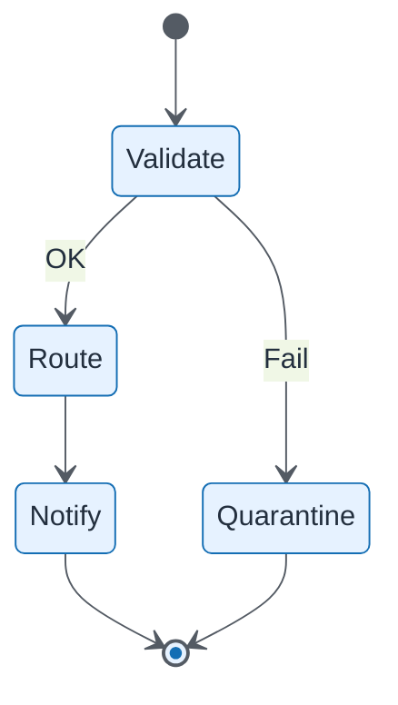

# Step Functions State Machine

| Field | Value |
| ----- | ----- |
| ID | `m06-sequence-step-functions-state-machine` |
| Category | `sequence` |
| Module | `module-06` |
| Lesson | 6.3 |
| Lab | lab-06 |
| Learning objective | Integration/data architecture: Step Functions State Machine |
| AWS icons | AWS Step Functions, AWS Lambda |

## Formats

- Mermaid: [`module-06/mermaid/sequence/m06-sequence-step-functions-state-machine.mmd`](module-06/mermaid/sequence/m06-sequence-step-functions-state-machine.mmd)
- Draw.io: [`module-06/drawio/sequence/m06-sequence-step-functions-state-machine.drawio`](module-06/drawio/sequence/m06-sequence-step-functions-state-machine.drawio)
- SVG: [`module-06/svg/sequence/m06-sequence-step-functions-state-machine.svg`](module-06/svg/sequence/m06-sequence-step-functions-state-machine.svg)
- PNG: [`module-06/png/sequence/m06-sequence-step-functions-state-machine.png`](module-06/png/sequence/m06-sequence-step-functions-state-machine.png)

## Mermaid

> Presentation masters for AWS reference architectures should be refined in Draw.io using official **AWS Architecture Icons** (AWS19/AWS23 stencil). Mermaid preserves structure and learning intent.
