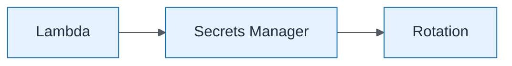

# Secrets Manager Usage

| Field | Value |
| ----- | ----- |
| ID | `m07-security-secrets-manager-usage` |
| Category | `security` |
| Module | `module-07` |
| Lesson | 7.3 |
| Lab | lab-07 |
| Learning objective | Security/resilience: Secrets Manager Usage |
| AWS icons | AWS Secrets Manager, AWS Lambda |

## Formats

- Mermaid: [`module-07/mermaid/security/m07-security-secrets-manager-usage.mmd`](module-07/mermaid/security/m07-security-secrets-manager-usage.mmd)
- Draw.io: [`module-07/drawio/security/m07-security-secrets-manager-usage.drawio`](module-07/drawio/security/m07-security-secrets-manager-usage.drawio)
- SVG: [`module-07/svg/security/m07-security-secrets-manager-usage.svg`](module-07/svg/security/m07-security-secrets-manager-usage.svg)
- PNG: [`module-07/png/security/m07-security-secrets-manager-usage.png`](module-07/png/security/m07-security-secrets-manager-usage.png)

## Mermaid

> Presentation masters for AWS reference architectures should be refined in Draw.io using official **AWS Architecture Icons** (AWS19/AWS23 stencil). Mermaid preserves structure and learning intent.
