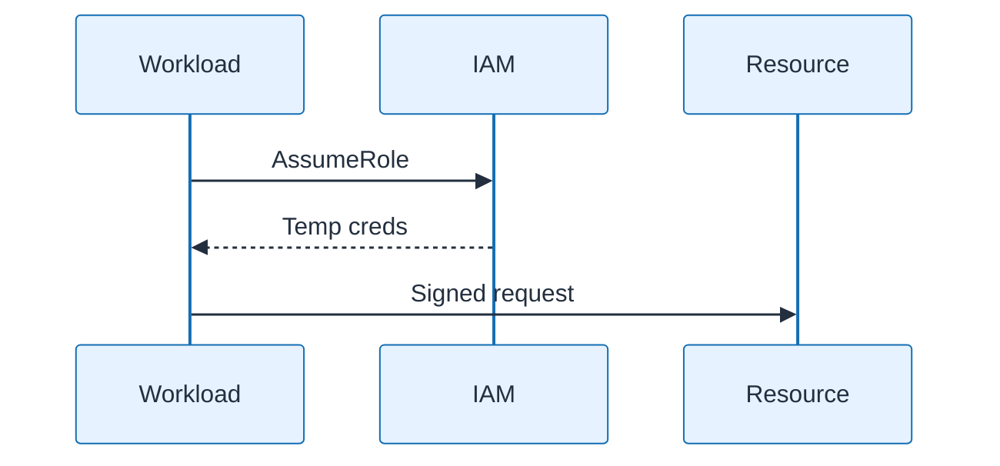

# IAM Role Assumption

| Field | Value |
| ----- | ----- |
| ID | `m07-sequence-iam-role-assumption` |
| Category | `sequence` |
| Module | `module-07` |
| Lesson | 7.1 |
| Lab | lab-07 |
| Learning objective | Security/resilience: IAM Role Assumption |
| AWS icons | IAM |

## Formats

- Mermaid: [`module-07/mermaid/sequence/m07-sequence-iam-role-assumption.mmd`](module-07/mermaid/sequence/m07-sequence-iam-role-assumption.mmd)
- Draw.io: [`module-07/drawio/sequence/m07-sequence-iam-role-assumption.drawio`](module-07/drawio/sequence/m07-sequence-iam-role-assumption.drawio)
- SVG: [`module-07/svg/sequence/m07-sequence-iam-role-assumption.svg`](module-07/svg/sequence/m07-sequence-iam-role-assumption.svg)
- PNG: [`module-07/png/sequence/m07-sequence-iam-role-assumption.png`](module-07/png/sequence/m07-sequence-iam-role-assumption.png)

## Mermaid

> Presentation masters for AWS reference architectures should be refined in Draw.io using official **AWS Architecture Icons** (AWS19/AWS23 stencil). Mermaid preserves structure and learning intent.
