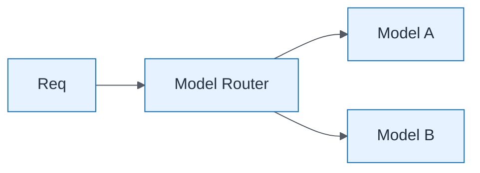

# Multi Model Routing Conceptual

| Field | Value |
| ----- | ----- |
| ID | `m08-aws-multi-model-routing-conceptual` |
| Category | `aws` |
| Module | `module-08` |
| Lesson | 8.3 |
| Lab | lab-08 |
| Learning objective | AI strategy: Multi Model Routing Conceptual |
| AWS icons | Amazon Bedrock |

## Formats

- Mermaid: [`module-08/mermaid/aws/m08-aws-multi-model-routing-conceptual.mmd`](module-08/mermaid/aws/m08-aws-multi-model-routing-conceptual.mmd)
- Draw.io: [`module-08/drawio/aws/m08-aws-multi-model-routing-conceptual.drawio`](module-08/drawio/aws/m08-aws-multi-model-routing-conceptual.drawio)
- SVG: [`module-08/svg/aws/m08-aws-multi-model-routing-conceptual.svg`](module-08/svg/aws/m08-aws-multi-model-routing-conceptual.svg)
- PNG: [`module-08/png/aws/m08-aws-multi-model-routing-conceptual.png`](module-08/png/aws/m08-aws-multi-model-routing-conceptual.png)

## Mermaid

> Presentation masters for AWS reference architectures should be refined in Draw.io using official **AWS Architecture Icons** (AWS19/AWS23 stencil). Mermaid preserves structure and learning intent.
