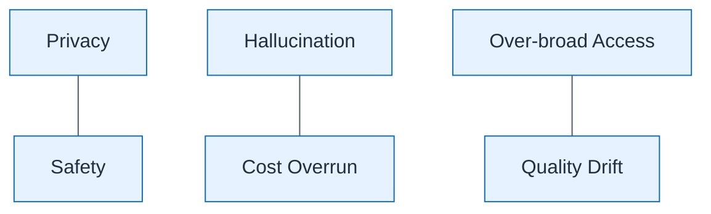

# AI Risk Register Visual

| Field | Value |
| ----- | ----- |
| ID | `m08-concept-ai-risk-register-visual` |
| Category | `concept` |
| Module | `module-08` |
| Lesson | 8.2 |
| Lab | lab-08 |
| Learning objective | AI strategy: AI Risk Register Visual |
| AWS icons | _None (non-AWS concept)_ |

## Formats

- Mermaid: [`module-08/mermaid/concept/m08-concept-ai-risk-register-visual.mmd`](module-08/mermaid/concept/m08-concept-ai-risk-register-visual.mmd)
- Draw.io: [`module-08/drawio/concept/m08-concept-ai-risk-register-visual.drawio`](module-08/drawio/concept/m08-concept-ai-risk-register-visual.drawio)
- SVG: [`module-08/svg/concept/m08-concept-ai-risk-register-visual.svg`](module-08/svg/concept/m08-concept-ai-risk-register-visual.svg)
- PNG: [`module-08/png/concept/m08-concept-ai-risk-register-visual.png`](module-08/png/concept/m08-concept-ai-risk-register-visual.png)

## Mermaid

> Presentation masters for AWS reference architectures should be refined in Draw.io using official **AWS Architecture Icons** (AWS19/AWS23 stencil). Mermaid preserves structure and learning intent.
