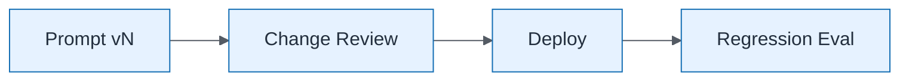

# Prompt Version Control

| Field | Value |
| ----- | ----- |
| ID | `m08-concept-prompt-version-control` |
| Category | `concept` |
| Module | `module-08` |
| Lesson | 8.1 |
| Lab | lab-08 |
| Learning objective | AI strategy: Prompt Version Control |
| AWS icons | _None (non-AWS concept)_ |

## Formats

- Mermaid: [`module-08/mermaid/concept/m08-concept-prompt-version-control.mmd`](module-08/mermaid/concept/m08-concept-prompt-version-control.mmd)
- Draw.io: [`module-08/drawio/concept/m08-concept-prompt-version-control.drawio`](module-08/drawio/concept/m08-concept-prompt-version-control.drawio)
- SVG: [`module-08/svg/concept/m08-concept-prompt-version-control.svg`](module-08/svg/concept/m08-concept-prompt-version-control.svg)
- PNG: [`module-08/png/concept/m08-concept-prompt-version-control.png`](module-08/png/concept/m08-concept-prompt-version-control.png)

## Mermaid

> Presentation masters for AWS reference architectures should be refined in Draw.io using official **AWS Architecture Icons** (AWS19/AWS23 stencil). Mermaid preserves structure and learning intent.
