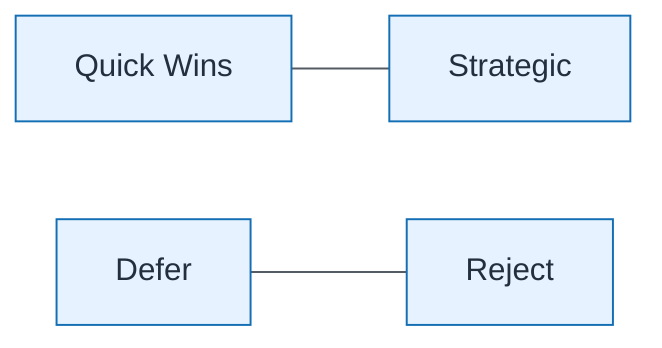

# Use Case Portfolio Board

| Field | Value |
| ----- | ----- |
| ID | `m08-executive-use-case-portfolio-board` |
| Category | `executive` |
| Module | `module-08` |
| Lesson | 8.4 |
| Lab | lab-08 |
| Learning objective | AI strategy: Use Case Portfolio Board |
| AWS icons | _None (non-AWS concept)_ |

## Formats

- Mermaid: [`module-08/mermaid/executive/m08-executive-use-case-portfolio-board.mmd`](module-08/mermaid/executive/m08-executive-use-case-portfolio-board.mmd)
- Draw.io: [`module-08/drawio/executive/m08-executive-use-case-portfolio-board.drawio`](module-08/drawio/executive/m08-executive-use-case-portfolio-board.drawio)
- SVG: [`module-08/svg/executive/m08-executive-use-case-portfolio-board.svg`](module-08/svg/executive/m08-executive-use-case-portfolio-board.svg)
- PNG: [`module-08/png/executive/m08-executive-use-case-portfolio-board.png`](module-08/png/executive/m08-executive-use-case-portfolio-board.png)

## Mermaid

> Presentation masters for AWS reference architectures should be refined in Draw.io using official **AWS Architecture Icons** (AWS19/AWS23 stencil). Mermaid preserves structure and learning intent.
