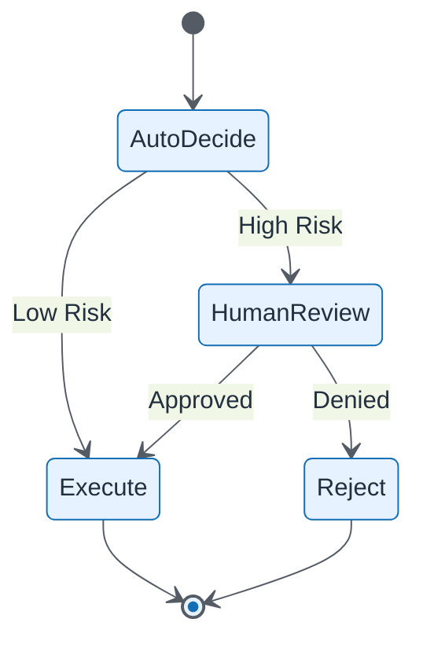

# Human in the Loop

| Field | Value |
| ----- | ----- |
| ID | `m08-sequence-human-in-the-loop` |
| Category | `sequence` |
| Module | `module-08` |
| Lesson | 8.3 |
| Lab | lab-08 |
| Learning objective | AI strategy: Human in the Loop |
| AWS icons | AWS Step Functions |

## Formats

- Mermaid: [`module-08/mermaid/sequence/m08-sequence-human-in-the-loop.mmd`](module-08/mermaid/sequence/m08-sequence-human-in-the-loop.mmd)
- Draw.io: [`module-08/drawio/sequence/m08-sequence-human-in-the-loop.drawio`](module-08/drawio/sequence/m08-sequence-human-in-the-loop.drawio)
- SVG: [`module-08/svg/sequence/m08-sequence-human-in-the-loop.svg`](module-08/svg/sequence/m08-sequence-human-in-the-loop.svg)
- PNG: [`module-08/png/sequence/m08-sequence-human-in-the-loop.png`](module-08/png/sequence/m08-sequence-human-in-the-loop.png)

## Mermaid

> Presentation masters for AWS reference architectures should be refined in Draw.io using official **AWS Architecture Icons** (AWS19/AWS23 stencil). Mermaid preserves structure and learning intent.
