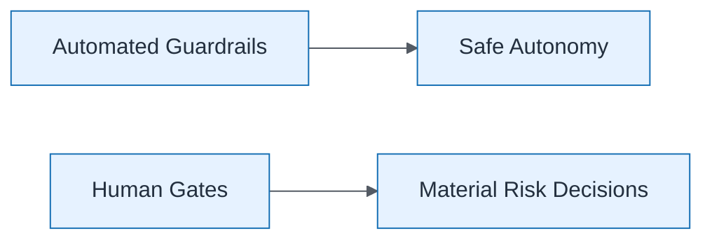

# Guardrails vs Gates

| Field | Value |
| ----- | ----- |
| ID | `m09-concept-guardrails-vs-gates` |
| Category | `concept` |
| Module | `module-09` |
| Lesson | 9.2 |
| Lab | lab-09 |
| Learning objective | Governance: Guardrails vs Gates |
| AWS icons | _None (non-AWS concept)_ |

## Formats

- Mermaid: [`module-09/mermaid/concept/m09-concept-guardrails-vs-gates.mmd`](module-09/mermaid/concept/m09-concept-guardrails-vs-gates.mmd)
- Draw.io: [`module-09/drawio/concept/m09-concept-guardrails-vs-gates.drawio`](module-09/drawio/concept/m09-concept-guardrails-vs-gates.drawio)
- SVG: [`module-09/svg/concept/m09-concept-guardrails-vs-gates.svg`](module-09/svg/concept/m09-concept-guardrails-vs-gates.svg)
- PNG: [`module-09/png/concept/m09-concept-guardrails-vs-gates.png`](module-09/png/concept/m09-concept-guardrails-vs-gates.png)

## Mermaid

> Presentation masters for AWS reference architectures should be refined in Draw.io using official **AWS Architecture Icons** (AWS19/AWS23 stencil). Mermaid preserves structure and learning intent.
