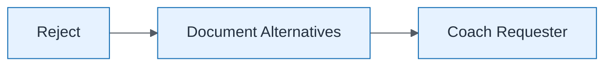

# Reject with Alternatives

| Field | Value |
| ----- | ----- |
| ID | `m09-concept-reject-with-alternatives` |
| Category | `concept` |
| Module | `module-09` |
| Lesson | 9.3 |
| Lab | lab-09 |
| Learning objective | Governance: Reject with Alternatives |
| AWS icons | _None (non-AWS concept)_ |

## Formats

- Mermaid: [`module-09/mermaid/concept/m09-concept-reject-with-alternatives.mmd`](module-09/mermaid/concept/m09-concept-reject-with-alternatives.mmd)
- Draw.io: [`module-09/drawio/concept/m09-concept-reject-with-alternatives.drawio`](module-09/drawio/concept/m09-concept-reject-with-alternatives.drawio)
- SVG: [`module-09/svg/concept/m09-concept-reject-with-alternatives.svg`](module-09/svg/concept/m09-concept-reject-with-alternatives.svg)
- PNG: [`module-09/png/concept/m09-concept-reject-with-alternatives.png`](module-09/png/concept/m09-concept-reject-with-alternatives.png)

## Mermaid

> Presentation masters for AWS reference architectures should be refined in Draw.io using official **AWS Architecture Icons** (AWS19/AWS23 stencil). Mermaid preserves structure and learning intent.
