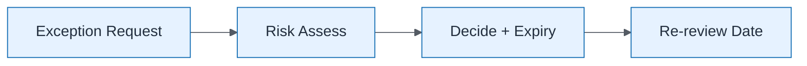

# Exception Waiver Process

| Field | Value |
| ----- | ----- |
| ID | `m09-process-exception-waiver-process` |
| Category | `process` |
| Module | `module-09` |
| Lesson | 9.3 |
| Lab | lab-09 |
| Learning objective | Governance: Exception Waiver Process |
| AWS icons | _None (non-AWS concept)_ |

## Formats

- Mermaid: [`module-09/mermaid/process/m09-process-exception-waiver-process.mmd`](module-09/mermaid/process/m09-process-exception-waiver-process.mmd)
- Draw.io: [`module-09/drawio/process/m09-process-exception-waiver-process.drawio`](module-09/drawio/process/m09-process-exception-waiver-process.drawio)
- SVG: [`module-09/svg/process/m09-process-exception-waiver-process.svg`](module-09/svg/process/m09-process-exception-waiver-process.svg)
- PNG: [`module-09/png/process/m09-process-exception-waiver-process.png`](module-09/png/process/m09-process-exception-waiver-process.png)

## Mermaid

> Presentation masters for AWS reference architectures should be refined in Draw.io using official **AWS Architecture Icons** (AWS19/AWS23 stencil). Mermaid preserves structure and learning intent.
