# Review Workflow 30 Minute

| Field | Value |
| ----- | ----- |
| ID | `m09-process-review-workflow-30-minute` |
| Category | `process` |
| Module | `module-09` |
| Lesson | 9.4 |
| Lab | lab-09 |
| Learning objective | Governance: Review Workflow 30 Minute |
| AWS icons | _None (non-AWS concept)_ |

## Formats

- Mermaid: [`module-09/mermaid/process/m09-process-review-workflow-30-minute.mmd`](module-09/mermaid/process/m09-process-review-workflow-30-minute.mmd)
- Draw.io: [`module-09/drawio/process/m09-process-review-workflow-30-minute.drawio`](module-09/drawio/process/m09-process-review-workflow-30-minute.drawio)
- SVG: [`module-09/svg/process/m09-process-review-workflow-30-minute.svg`](module-09/svg/process/m09-process-review-workflow-30-minute.svg)
- PNG: [`module-09/png/process/m09-process-review-workflow-30-minute.png`](module-09/png/process/m09-process-review-workflow-30-minute.png)

## Mermaid

```mermaid
%%{init: {
  "theme": "base",
  "themeVariables": {
    "primaryColor": "#E6F2FF",
    "primaryTextColor": "#232F3E",
    "primaryBorderColor": "#146EB4",
    "lineColor": "#545B64",
    "secondaryColor": "#F0F7E6",
    "tertiaryColor": "#FFF3E0",
    "background": "#FFFFFF",
    "fontFamily": "Amazon Ember, Helvetica, Arial, sans-serif"
  }
}}%%
gantt
  title ARB 30-Minute Simulation
  dateFormat mm
  axisFormat %M
  section Agenda
  Intake summary           :a1, 00, 5m
  Principle alignment      :a2, after a1, 5m
  Risks and alternatives   :a3, after a2, 10m
  Decision and conditions  :a4, after a3, 7m
  ADR owners               :a5, after a4, 3m
```

> Presentation masters for AWS reference architectures should be refined in Draw.io using official **AWS Architecture Icons** (AWS19/AWS23 stencil). Mermaid preserves structure and learning intent.
