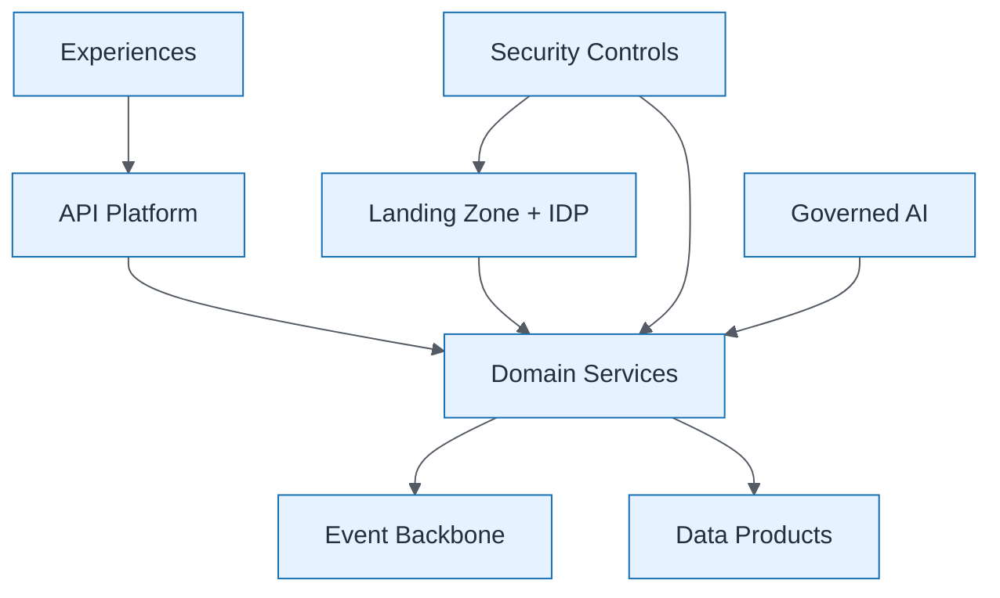

# Integrated Target State

| Field | Value |
| ----- | ----- |
| ID | `m10-aws-integrated-target-state` |
| Category | `aws` |
| Module | `module-10` |
| Lesson | 10.2 |
| Lab | lab-10 |
| Learning objective | Capstone leadership: Integrated Target State |
| AWS icons | Amazon API Gateway, Amazon EventBridge, IAM, Amazon Bedrock |

## Formats

- Mermaid: [`module-10/mermaid/aws/m10-aws-integrated-target-state.mmd`](module-10/mermaid/aws/m10-aws-integrated-target-state.mmd)
- Draw.io: [`module-10/drawio/aws/m10-aws-integrated-target-state.drawio`](module-10/drawio/aws/m10-aws-integrated-target-state.drawio)
- SVG: [`module-10/svg/aws/m10-aws-integrated-target-state.svg`](module-10/svg/aws/m10-aws-integrated-target-state.svg)
- PNG: [`module-10/png/aws/m10-aws-integrated-target-state.png`](module-10/png/aws/m10-aws-integrated-target-state.png)

## Mermaid

> Presentation masters for AWS reference architectures should be refined in Draw.io using official **AWS Architecture Icons** (AWS19/AWS23 stencil). Mermaid preserves structure and learning intent.
