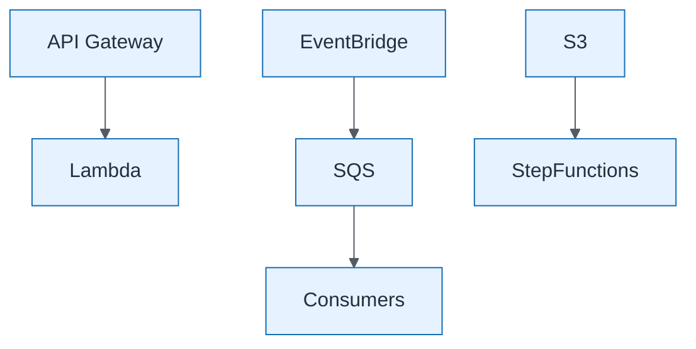

# Integration Hub Target Detail

| Field | Value |
| ----- | ----- |
| ID | `m10-aws-integration-hub-target-detail` |
| Category | `aws` |
| Module | `module-10` |
| Lesson | 10.1 |
| Lab | lab-10 |
| Learning objective | Capstone visual: Integration Hub Target Detail |
| AWS icons | Amazon API Gateway, Amazon Bedrock, IAM |

## Formats

- Mermaid: [`module-10/mermaid/aws/m10-aws-integration-hub-target-detail.mmd`](module-10/mermaid/aws/m10-aws-integration-hub-target-detail.mmd)
- Draw.io: [`module-10/drawio/aws/m10-aws-integration-hub-target-detail.drawio`](module-10/drawio/aws/m10-aws-integration-hub-target-detail.drawio)
- SVG: [`module-10/svg/aws/m10-aws-integration-hub-target-detail.svg`](module-10/svg/aws/m10-aws-integration-hub-target-detail.svg)
- PNG: [`module-10/png/aws/m10-aws-integration-hub-target-detail.png`](module-10/png/aws/m10-aws-integration-hub-target-detail.png)

## Mermaid

> Presentation masters for AWS reference architectures should be refined in Draw.io using official **AWS Architecture Icons** (AWS19/AWS23 stencil). Mermaid preserves structure and learning intent.
