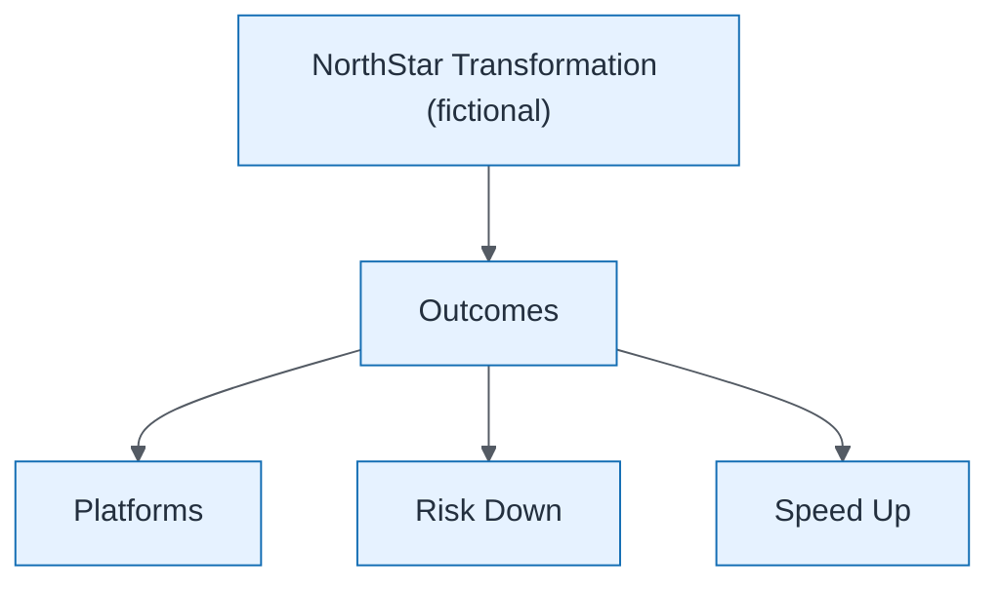

# Executive Transformation Overview

| Field | Value |
| ----- | ----- |
| ID | `m10-executive-executive-transformation-overview` |
| Category | `executive` |
| Module | `module-10` |
| Lesson | 10.3 |
| Lab | lab-10 |
| Learning objective | Capstone leadership: Executive Transformation Overview |
| AWS icons | _None (non-AWS concept)_ |

## Formats

- Mermaid: [`module-10/mermaid/executive/m10-executive-executive-transformation-overview.mmd`](module-10/mermaid/executive/m10-executive-executive-transformation-overview.mmd)
- Draw.io: [`module-10/drawio/executive/m10-executive-executive-transformation-overview.drawio`](module-10/drawio/executive/m10-executive-executive-transformation-overview.drawio)
- SVG: [`module-10/svg/executive/m10-executive-executive-transformation-overview.svg`](module-10/svg/executive/m10-executive-executive-transformation-overview.svg)
- PNG: [`module-10/png/executive/m10-executive-executive-transformation-overview.png`](module-10/png/executive/m10-executive-executive-transformation-overview.png)

## Mermaid

> Presentation masters for AWS reference architectures should be refined in Draw.io using official **AWS Architecture Icons** (AWS19/AWS23 stencil). Mermaid preserves structure and learning intent.
