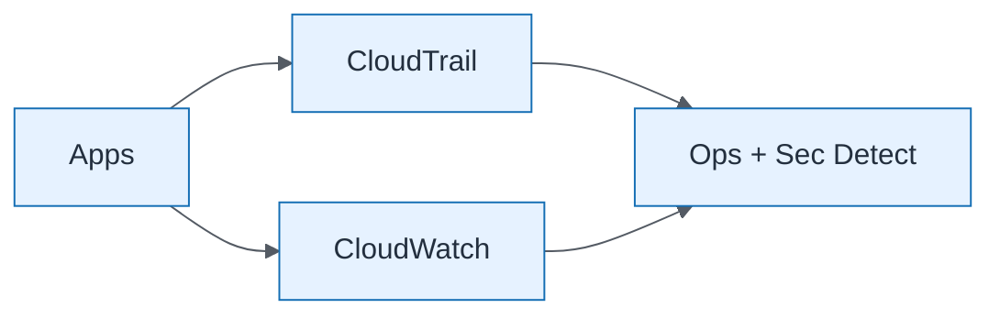

# Monitoring Target Stack

| Field | Value |
| ----- | ----- |
| ID | `m10-infrastructure-monitoring-target-stack` |
| Category | `infrastructure` |
| Module | `module-10` |
| Lesson | 10.1 |
| Lab | lab-10 |
| Learning objective | Capstone leadership: Monitoring Target Stack |
| AWS icons | _None (non-AWS concept)_ |

## Formats

- Mermaid: [`module-10/mermaid/infrastructure/m10-infrastructure-monitoring-target-stack.mmd`](module-10/mermaid/infrastructure/m10-infrastructure-monitoring-target-stack.mmd)
- Draw.io: [`module-10/drawio/infrastructure/m10-infrastructure-monitoring-target-stack.drawio`](module-10/drawio/infrastructure/m10-infrastructure-monitoring-target-stack.drawio)
- SVG: [`module-10/svg/infrastructure/m10-infrastructure-monitoring-target-stack.svg`](module-10/svg/infrastructure/m10-infrastructure-monitoring-target-stack.svg)
- PNG: [`module-10/png/infrastructure/m10-infrastructure-monitoring-target-stack.png`](module-10/png/infrastructure/m10-infrastructure-monitoring-target-stack.png)

## Mermaid

> Presentation masters for AWS reference architectures should be refined in Draw.io using official **AWS Architecture Icons** (AWS19/AWS23 stencil). Mermaid preserves structure and learning intent.
