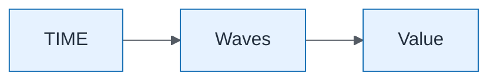

# Portfolio TIME to Waves Bridge

| Field | Value |
| ----- | ----- |
| ID | `m10-process-portfolio-time-to-waves-bridge` |
| Category | `process` |
| Module | `module-10` |
| Lesson | 10.1 |
| Lab | lab-10 |
| Learning objective | Capstone visual: Portfolio TIME to Waves Bridge |
| AWS icons | _None (non-AWS concept)_ |

## Formats

- Mermaid: [`module-10/mermaid/process/m10-process-portfolio-time-to-waves-bridge.mmd`](module-10/mermaid/process/m10-process-portfolio-time-to-waves-bridge.mmd)
- Draw.io: [`module-10/drawio/process/m10-process-portfolio-time-to-waves-bridge.drawio`](module-10/drawio/process/m10-process-portfolio-time-to-waves-bridge.drawio)
- SVG: [`module-10/svg/process/m10-process-portfolio-time-to-waves-bridge.svg`](module-10/svg/process/m10-process-portfolio-time-to-waves-bridge.svg)
- PNG: [`module-10/png/process/m10-process-portfolio-time-to-waves-bridge.png`](module-10/png/process/m10-process-portfolio-time-to-waves-bridge.png)

## Mermaid

> Presentation masters for AWS reference architectures should be refined in Draw.io using official **AWS Architecture Icons** (AWS19/AWS23 stencil). Mermaid preserves structure and learning intent.
