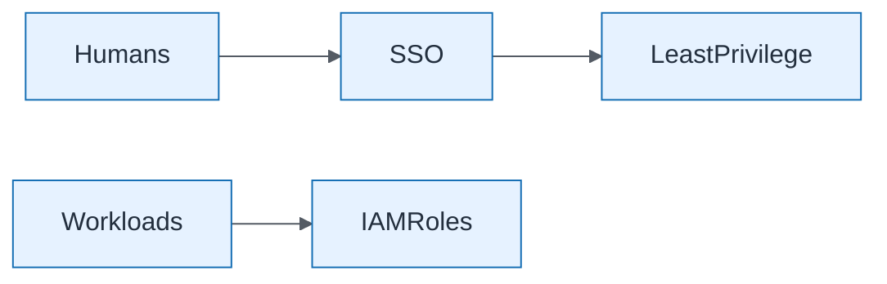

# Identity Target State

| Field | Value |
| ----- | ----- |
| ID | `m10-security-identity-target-state` |
| Category | `security` |
| Module | `module-10` |
| Lesson | 10.1 |
| Lab | lab-10 |
| Learning objective | Capstone visual: Identity Target State |
| AWS icons | Amazon API Gateway, Amazon Bedrock, IAM |

## Formats

- Mermaid: [`module-10/mermaid/security/m10-security-identity-target-state.mmd`](module-10/mermaid/security/m10-security-identity-target-state.mmd)
- Draw.io: [`module-10/drawio/security/m10-security-identity-target-state.drawio`](module-10/drawio/security/m10-security-identity-target-state.drawio)
- SVG: [`module-10/svg/security/m10-security-identity-target-state.svg`](module-10/svg/security/m10-security-identity-target-state.svg)
- PNG: [`module-10/png/security/m10-security-identity-target-state.png`](module-10/png/security/m10-security-identity-target-state.png)

## Mermaid

> Presentation masters for AWS reference architectures should be refined in Draw.io using official **AWS Architecture Icons** (AWS19/AWS23 stencil). Mermaid preserves structure and learning intent.
