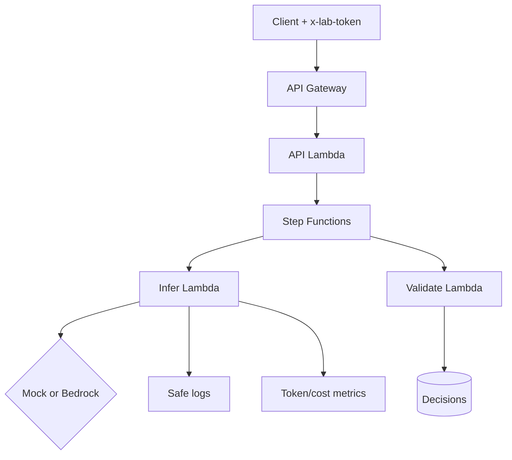

# Lab 08 Architecture Diagram

```mermaid
flowchart TB
  C[Client + x-lab-token] --> API[API Gateway]
  API --> Lapi[API Lambda]
  Lapi --> SFN[Step Functions]
  SFN --> Infer[Infer Lambda]
  Infer --> BR{Mock or Bedrock}
  SFN --> Val[Validate Lambda]
  Val --> DDB[(Decisions)]
  Infer --> S3[Safe logs]
  Infer --> CW[Token/cost metrics]
```

NorthStar Financial Services is fictional. Mock mode is default.
