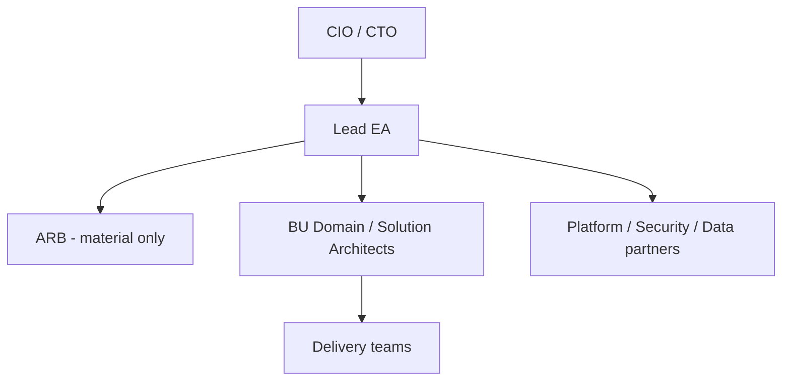

# Lab 01 — Establish NorthStar’s Architecture Function

**Module:** 01 — The Enterprise Architect’s Role  
**Estimated duration:** 40 minutes live + polish as homework  
**Estimated cost:** N/A (non-AWS)  
**Case study:** NorthStar Financial Services (fictional)  
**Student role:** Lead Enterprise Architect

---

## 1. Lab title

Establish NorthStar’s Architecture Function (Architecture Operating Model Pack)

## 2. Business context

NorthStar Financial Services (**fictional**) has architects embedded in Retail Banking, Payments, Partner Channels, and Wealth. Each optimizes locally. There is no shared set of principles, inconsistent decision rights, and weak executive visibility into technology risk. Overlapping identity initiatives were funded last quarter; partner onboarding still spans multiple integration approaches; security is often engaged after commitments are made.

The CIO appointed you Lead Enterprise Architect and asked for an operating model before the next Executive Committee technology review. You do **not** have line authority over BU architects. Your credibility will come from clarity, usefulness, and coalition—not title alone.

Leadership intents you must respect: reduce operating cost ~20%, improve onboarding and product speed, standardize cloud adoption, improve resilience/compliance, consolidate integration platforms, govern AI, and improve executive technology visibility—while accepting coexistence of acquired systems.

## 3. Learning objectives

1. Design a NorthStar-fit architecture operating model with explicit structural trade-offs.  
2. Define decision rights, RACI, and engagement modes that balance autonomy and enterprise risk.  
3. Write 8–10 principles with exceptions and signals tied to strategy.  
4. Identify risks to the architecture function itself (adoption, capacity, bypass).

## 4. Architecture diagram

Your diagram should show enterprise vs. federated boundaries. Starter shape:

Refine freely; see also `modules/module-01-enterprise-architect-role/diagrams/operating-model.mmd`.

## 5. Prerequisites

- Read NorthStar case study baseline  
- Skim principles and RACI templates  
- Complete Module 01 lessons 1.1–1.4 concepts (live or reading)

## 6. Tasks

1. **Write the mission** (½ page max): what EA is accountable for; what it explicitly does not own; link to NorthStar outcomes.  
2. **Choose a structural option** (central / federated / hybrid): justify with trade-offs; name what you reject and the risk you accept.  
3. **Draw the operating model** (Mermaid preferred): show Lead EA, ARB (if any), BU architects, Platform/Security/Data, delivery teams.  
4. **Define decision classes** and a **decision rights summary** (who is Accountable; escalation).  
5. **Build a RACI** for at least 8 architecture activities/decisions (use template 05). Enforce a **single Accountable** per row.  
6. **Draft 8–10 principles** using template 03 (statement, rationale, implications, exceptions, signals). Avoid technology shopping lists.  
7. **Specify the engagement model**: how teams request help; consult vs collaborate vs govern; ARB triggers and non-triggers; rough SLAs.  
8. **Create a risk register** (≥5 risks) for the *architecture function* (bypass, capacity, dual accountability, late security, etc.), not only generic IT outages.  
9. **Self-check** against [`submission-checklist.md`](submission-checklist.md).

## 7. Deliverables

| Deliverable | Format | Capstone link |
| ----------- | ------ | ------------- |
| Mission statement | Markdown | Capstone operating narrative |
| Operating model diagram | Mermaid or PNG+source | Capstone org/engagement appendix |
| RACI matrix | Markdown table | Governance baseline |
| Principles (8–10) | Markdown | Principles v1 |
| Decision rights summary | Markdown table | Decision rights baseline |
| Engagement model | Markdown | ARB precursor (Module 09) |
| Risk register | Markdown table | Risk seed |

## 8. Validation steps

- [ ] Fiction notice present on title block  
- [ ] Mission states non-ownership of delivery backlogs (or explicitly justifies otherwise)  
- [ ] Structural option includes rejected alternatives  
- [ ] Every RACI row has exactly one **A**  
- [ ] Principles are 8–10 with exception paths  
- [ ] ARB scope is bounded (or absence of ARB is justified)  
- [ ] Security appears in principles and/or RACI proportionately  
- [ ] ≥5 architecture-function risks with owners  

## 9. Common failure scenarios

| Symptom | Likely cause | Recovery |
| ------- | ------------ | -------- |
| Cannot finish principles | Started with diagram aesthetics | Draft 8 one-line statements first; expand later |
| RACI thrash | Two executives both want A | Pick one A; make the other C/I; document escalation |
| “Everything goes to ARB” | Fear of missing risk | List non-triggers; invest in guardrails language |
| Principles name vendors | Standards vs principles confusion | Move products to a “standards backlog” note |

## 10. Troubleshooting

- If Mermaid will not render, submit `.mmd`/markdown source plus exported PNG.  
- If stuck on hybrid vs federated: write the decision classes first—structure follows.  
- If wordy: CIO skim test—can they understand mission + decision rights in 10 minutes?

## 11. Submission requirements

Submit via BayLearn assignment `module-01` (lab portion may be combined with assignment per cohort calendar):

- Single markdown pack **or** clearly named files: `M01_Mission_*.md`, `M01_RACI_*.md`, etc.  
- Use naming: `M01_<Artifact>_<LastName>.<ext>`  
- Standard architecture rubric applies  

## 12. Stretch objectives

See [`stretch-objectives.md`](stretch-objectives.md).

## 13. Templates

- [`../../student/templates/03-architecture-principles.md`](../../student/templates/03-architecture-principles.md)  
- [`../../student/templates/05-raci-matrix.md`](../../student/templates/05-raci-matrix.md)

## 14. Reference solution

Instructor-only: `instructor/reference-solutions/module-01/`
