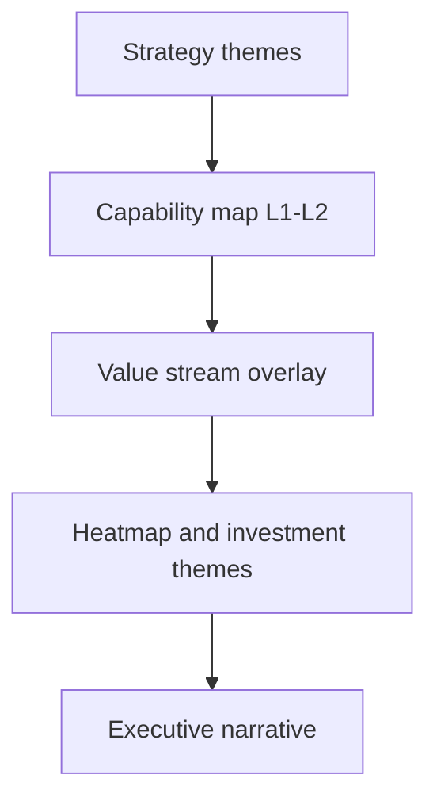

# Lab 02 — Build NorthStar’s Business Capability Map

**Module:** 02 — Business Architecture and Capability Mapping  
**Estimated duration:** 40 minutes live (+ finish as homework if needed)  
**Estimated cost:** N/A (non-AWS)  
**Case study:** NorthStar Financial Services (fictional)  
**Student role:** Lead Enterprise Architect

---

## 1. Lab title

Build NorthStar’s Business Capability Map

## 2. Business context

NorthStar Financial Services (fictional) is under pressure to cut operating cost, improve customer onboarding, accelerate digital products, and raise risk visibility. Acquired companies still duplicate capabilities. As Lead Enterprise Architect, you must establish a shared capability language before Module 03’s portfolio assessment—or TIME scoring will become a fight about systems instead of business value.

## 3. Learning objectives

1. Produce an org- and system-independent Level 1–2 capability map with ownership and types.
2. Overlay Customer Onboarding stages to capabilities and name architecture-relevant frictions.
3. Build a heatmap with evidence that supports a short investment narrative.

## 4. Architecture diagram

## 5. Prerequisites

- NorthStar case study baseline read
- Templates 06, 21, and 22 available
- Module 01 understanding of EA decision facilitation

## 6. Tasks

1. Draft 10–14 Level 1 capabilities covering customer, payments, partner, risk/trust, platforms, and corporate domains.
2. Classify each as Core, Supporting, or Commodity; assign a primary business owner (role or fictional title).
3. Expand five Level 1 capabilities to Level 2 (3–7 children each).
4. Map Customer Onboarding value-stream stages; list capabilities invoked per stage; mark ≥3 frictions.
5. Score maturity for ≥8 capabilities (process/data/technology/people or overall with evidence); apply heatmap legend; state confidence.
6. Write a half-page investment narrative: top 3 capability uplifts, one explicit trade-off, assumptions.

## 7. Deliverables

| Deliverable | Format | Capstone link |
| ----------- | ------ | ------------- |
| Capability map L1–L2 | Markdown/table (+ optional Mermaid) | Capstone capability baseline |
| Value-stream overlay | Template 21 or equivalent | Transformation value narrative |
| Heatmap + investment narrative | Template 22 + ½–1 page prose | Investment themes for roadmap |

## 8. Validation steps

- [ ] No L1 names are applications, teams, or projects
- [ ] Commodity and Core both appear with rationale
- [ ] Onboarding includes identity/KYC/monitoring-related stages (not happy path only)
- [ ] Heatmap legend and evidence present
- [ ] Trade-off explicitly names what is delayed

## 9. Common failure scenarios

| Symptom | Likely cause | Recovery |
| ------- | ------------ | -------- |
| Map looks like org chart | LOB cloning | Rename to stable business verbs/nouns |
| All red heatmap | No prioritization | Force top 3 investments only |
| Friction list is “legacy” | Vague analysis | Classify data vs integration vs ownership vs control |
| Owners all “IT” | Wrong accountability | Assign business executive roles |

## 10. Troubleshooting

- Stuck on naming: write the outcome if the capability vanished, then name that ability.
- Stuck on ownership: ask who feels P&L or risk pain when it fails.
- Running out of time: finish L1 + onboarding overlay + 5 scored capabilities; complete L2 as homework.

## 11. Submission requirements

Submit via BayLearn:

- Capability map artifact
- Value-stream overlay
- Heatmap + investment narrative

Use the standard architecture rubric and Module 02 rubric notes.  
File names: `M02_<Artifact>_<LastName>.<ext>`

## 12. Stretch objectives

See [`stretch-objectives.md`](stretch-objectives.md).

## 13. Templates

- [`../../student/templates/06-capability-map.md`](../../student/templates/06-capability-map.md)
- [`../../student/templates/21-value-stream-map.md`](../../student/templates/21-value-stream-map.md)
- [`../../student/templates/22-capability-heatmap.md`](../../student/templates/22-capability-heatmap.md)

## 14. Reference solution

Instructor-only: `instructor/reference-solutions/module-02/`
