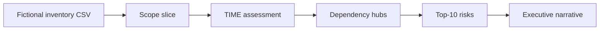

# Lab 03 — Assess NorthStar’s Current Technology Estate

**Module:** 03 — Current-State Architecture Assessment  
**Estimated duration:** 40 minutes live (+ finish as homework if needed)  
**Estimated cost:** N/A (non-AWS)  
**Case study:** NorthStar Financial Services (fictional)  
**Student role:** Lead Enterprise Architect

---

## 1. Lab title

Assess NorthStar’s Current Technology Estate

## 2. Business context

NorthStar (fictional) needs executive-visible portfolio insight: where cost, risk, and duplication concentrate; which applications to Tolerate, Invest, Migrate, or Eliminate; and which dependency hubs constrain change. You will use a **fictional 45-application inventory sample**—not invent a 300-app CMDB in one sitting.

## 3. Learning objectives

1. Scope discovery and assess a decision-relevant slice of the portfolio.
2. Apply TIME with rationale and challenge seed dispositions.
3. Identify hubs/duplicates and produce a top-risk / debt narrative.

## 4. Architecture diagram

## 5. Prerequisites

- Module 02 capability themes available
- CSV readable in a spreadsheet tool
- Templates 07 and 08

## 6. Tasks

1. **Write the decision** this assessment supports (e.g., ExCo risk briefing; Wave-1 consolidation candidates).
2. **Scope** a slice (≥12 and ≤25 apps) using criticality, capability, cost, EOL, or Module 02 themes. Document inclusion rules.
3. **TIME-assess** each in-scope app (use template 07). Record your TIME even when it differs from CSV Recommended disposition; mark Agree/Challenge.
4. **Challenge ≥3 seed dispositions** with dimension-based rationale.
5. **Dependency notes:** identify ≥2 hubs or duplicate clusters; state sequencing implications for at least one Migrate/Eliminate candidate.
6. **Top-10 risks / debt register** (template 08 acceptable): business impact, evidence (app IDs), response, residual risk. Ten items maximum for the leadership list (you may have a longer backlog separately).
7. **Half-page synthesis** linking findings to Module 02 investment themes and coexistence constraints.

## 7. Deliverables

| Deliverable | Format | Capstone link |
| ----------- | ------ | ------------- |
| Scoped TIME assessment | Spreadsheet or Markdown | Current-state TIME summary |
| Dependency / concentration notes | 1 page | Roadmap sequencing input |
| Top-10 risk / technical-debt register | Template 08 or table | Capstone risk narrative |

## 8. Validation steps

- [ ] Scope rules explicit; not all 45 deeply scored unless justified
- [ ] ≥3 disposition challenges with rationale
- [ ] At least one hub and one duplicate cluster
- [ ] Top-10 uses business impact language
- [ ] No instant Eliminate of core banking without Migrate framing
- [ ] Fiction notice retained if exporting externally

## 9. Common failure scenarios

| Symptom | Likely cause | Recovery |
| ------- | ------------ | -------- |
| Identical to CSV dispositions | No analysis | Force 3 challenges |
| 45 rows, no narrative | Boiling ocean | Cut scope; deepen |
| Eliminate dates next month for hubs | Dependency blindness | Add wave constraint |
| Tech jargon only | Missing exec lens | Rewrite impact sentences |

## 10. Troubleshooting

- Overwhelm: filter Mission Critical + High first, then add duplicate clusters.
- Ambiguous capability mapping: note challenge to CSV capability column as assumption.
- Time: finish TIME for 12 apps + 5 risks in session; complete top-10 as homework.

## 11. Submission requirements

Submit via BayLearn:

- TIME assessment artifact
- Dependency notes
- Top-10 risk/debt register (+ short synthesis)

File names: `M03_<Artifact>_<LastName>.<ext>`  
Rubric: standard + Module 03 notes.

## 12. Stretch objectives

See [`stretch-objectives.md`](stretch-objectives.md).

## 13. Templates & data

- [`../../student/datasets/northstar-application-inventory.csv`](../../student/datasets/northstar-application-inventory.csv)
- [`../../student/datasets/README.md`](../../student/datasets/README.md)
- [`../../student/templates/07-time-assessment.md`](../../student/templates/07-time-assessment.md)
- [`../../student/templates/08-technical-debt-register.md`](../../student/templates/08-technical-debt-register.md)

## 14. Reference solution

Instructor-only: `instructor/reference-solutions/module-03/`
