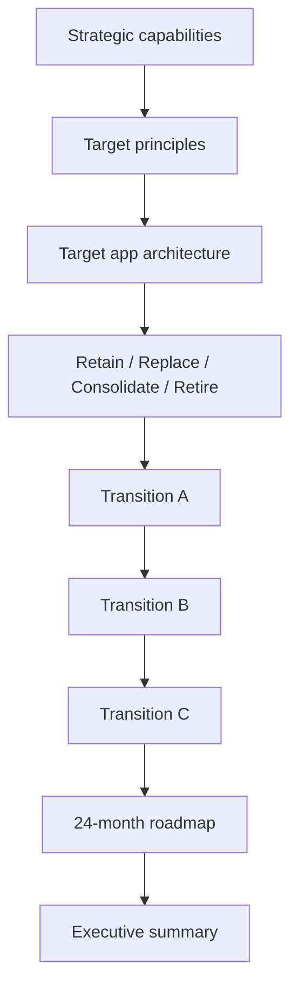

# Lab 04 — Student Instructions

**Lab title:** Create NorthStar’s Target-State Roadmap  
**Module:** 04 — Target-State Architecture and Transformation Roadmaps  
**Estimated duration:** 40 minutes in-session + homework to finalize  
**Case study:** NorthStar Financial Services (fictional)  
**Student role:** Lead Enterprise Architect

---

## 1. Lab title

Create NorthStar’s Target-State Roadmap

## 2. Business context

NorthStar’s Executive Committee has approved a transformation mandate:

- Reduce operating costs by ~20% over the planning horizon  
- Improve customer onboarding cycle time  
- Standardize cloud adoption and reduce account sprawl  
- Consolidate integration platforms  
- Improve resilience and compliance posture  
- Prepare for governed AI (not unconstrained AI platforms)

You completed (or reviewed) current-state and TIME work in Module 03. Leadership now asks you for a **target-state architecture** and a **24-month roadmap** that shows phased value—not a big-bang rewrite.

Named pressure points (fictional):

- Duplicate CRMs (NovaCRM vs LegacyCRM)  
- Multiple file-transfer platforms (PartnerLink Classic, FileBridge, SyncHub)  
- StarCore banking suite as high-coupling system of record  
- PayForge acquired payments stack on the critical path  
- Fragmented onboarding (OnboardX + BU portals)

## 3. Learning objectives

1. Define target-state architecture aligned to capabilities, principles, and constraints (LO-4.1).  
2. Apply modernization dispositions including retain / replace / consolidate / retire (LO-4.2).  
3. Design three transition architectures with exit criteria (LO-4.3).  
4. Produce a dependency-aware 24-month roadmap with value, risks, and executive summary (LO-4.4).

## 4. Architecture diagram

## 5. Prerequisites

- Module 03 current-state / TIME notes (or instructor catch-up pack)
- Draft architecture principles (Module 01)
- Capability awareness (Module 02)
- Templates 23, 24, and 09

## 6. Tasks

Complete all tasks. Document assumptions explicitly.

### Task 1 — Strategic capabilities

Select **6–10** capabilities that define the target investment story. For each, mark Invest / Sustain / Exit and note the target pattern (one sentence).

### Task 2 — Target principles

Produce **5–7** target-state principles. Each must include: statement, implication, and one valid exception example.

### Task 3 — Target application architecture

Describe the target application / platform architecture at **pattern level**:

- Systems of engagement vs systems of record  
- Shared platforms (identity, integration, observability, data)  
- Explicit non-goals for 24 months  

Include a simple diagram (Mermaid or structured table).

### Task 4 — Disposition decisions

For at least **eight** applications or platform groups, assign:

**retain / replace / consolidate / retire**  
(optionally note rehost / replatform / refactor as execution detail)

Include one-sentence rationale and whether dual-run is expected.

### Task 5 — Three transition states

Using template 23, define **Transition A, B, and C** with:

- Timebox  
- Architecture headline  
- Coexistence patterns  
- Observable exit criteria  
- Major risks in that state  

### Task 6 — 24-month roadmap

Using template 09 (or equivalent), produce phases covering 24 months with:

- Theme per phase  
- Business value per phase  
- Risk reduced per phase  
- Major deliverables  
- Dependencies  
- Funding note  

### Task 7 — Value, risks, and executive summary

- Value-versus-risk scores for 6–10 initiatives  
- Risk register (at least 5 transformation risks with mitigations)  
- Executive summary (≤1 page) stating the ask and decisions needed  

## 7. Deliverables

| Deliverable | Format | Capstone link |
| ----------- | ------ | ------------- |
| Target-state architecture | Markdown (template 24) | Target-state artifact |
| Transition-state plan (A/B/C) | Markdown (template 23) | Transition-state plan |
| 24-month roadmap + value-vs-risk | Markdown (template 09) | Architecture roadmap |
| Executive summary | Section in roadmap or memo | Capstone narrative seed |

## 8. Validation steps

- [ ] Capabilities trace to NorthStar strategic themes  
- [ ] Principles constrain technology choices (not slogans)  
- [ ] Dispositions include retain **and** consolidate **and** retire (not replace-only)  
- [ ] Three transitions have observable exit criteria  
- [ ] Roadmap shows dependencies (nothing is “all Month 1”)  
- [ ] Each phase states business value and risk reduced  
- [ ] Risks include coexistence / dual-run / data / identity concerns  
- [ ] Executive summary is readable by CIO/CFO in 3 minutes  
- [ ] Assumptions documented  
- [ ] At least one trade-off table or ADR-style decision  

## 9. Common failure scenarios

| Symptom | Likely cause | Recovery |
| ------- | ------------ | -------- |
| Target is a vendor product list | No capability/principle frame | Restart from Tasks 1–2 |
| Only “replace” dispositions | Avoidance of retain/consolidate | Force survivor vs rewrite trade-off |
| Transitions lack exit criteria | Project-phase thinking | Add measurable gates |
| Roadmap is a backlog dump | No sequencing principles | Apply value-vs-risk + dependencies |
| Exec summary is jargon | Wrong audience | Lead with outcomes and asks |

## 10. Troubleshooting

- Stuck on StarCore? Default to **retain + replatform waves**, not year-one rewrite.  
- Stuck on CRM? Require a **survivor ADR** before migration waves.  
- Stuck on partners? Separate **new volume** (API path) from **drain legacy** (retire bridges).  
- Missing Module 03 inventory? Use the fictional apps named in this lab plus 3–4 of your own consistent inventions; label them fictional.

## 11. Submission requirements

Submit via BayLearn assignment for Module 04 / Lab 04:

1. Completed target-state template (24)  
2. Completed transition-state plan (23)  
3. Completed roadmap (09) including value-vs-risk, risks, executive summary  

Naming: `M04_<Artifact>_<LastName>.md`  
Grading: standard architecture rubric + Module 04 emphasis notes.

## 12. Stretch objectives

See [`stretch-objectives.md`](stretch-objectives.md).

## 13. Templates

- `student/templates/24-target-state-architecture.md`
- `student/templates/23-transition-state-plan.md`
- `student/templates/09-architecture-roadmap.md`
- Optional: `02-executive-decision-memo.md` for the summary

## 14. Reference solution

Instructor-only. Not provided in student packages.
