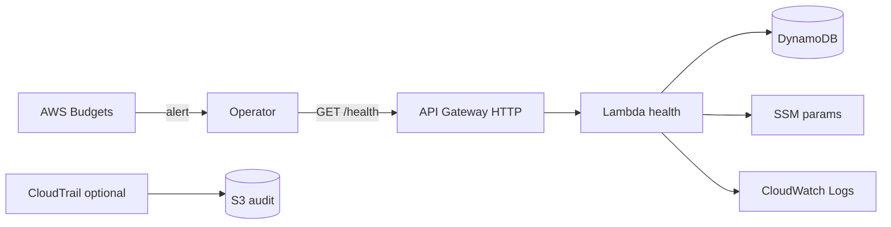

# AWS Lab 05 — Design and Deploy a Low-Cost Enterprise Platform Foundation

**Module:** 05 — Cloud and Platform Strategy  
**Estimated duration:** 90–120 minutes  
**Estimated cost:** ~<$5 (when cleaned up promptly)  
**Region recommendation:** us-east-1  
**Case study:** NorthStar Financial Services (fictional)

---

## Cost and safety rules

- Prefer serverless; avoid NAT Gateway, always-on EC2, EKS, OpenSearch
- Tag all resources
- Create/verify a budget alert as part of deploy
- Run cleanup at the end of the session
- **AWS Config is OPTIONAL** — leave `enable_config = false` unless stretch; it incurs ongoing cost

### Required tags

```text
Project=BayLearn
Course=EnterpriseArchitectureLeadership
Module=05
Student=<student-id>
Environment=Lab
ExpirationDate=<YYYY-MM-DD>
```

---

## 1. Lab title

Design and Deploy a Low-Cost Enterprise Platform Foundation

## 2. Business context

NorthStar (fictional) suffers uncontrolled account sprawl and weak cloud governance. Leadership wants standardized cloud adoption with FinOps visibility. You will deploy a **thin platform foundation** that demonstrates audit storage, optional CloudTrail, identity-scoped Lambda access, configuration via SSM, a health API, DynamoDB registry heartbeats, CloudWatch Logs, and an AWS Budget—then document the strategy artifacts that justify these controls.

## 3. Learning objectives

1. Deploy a tagged, budget-aware platform foundation with Terraform
2. Map lab controls to landing-zone / FinOps concepts
3. Produce cloud strategy, capability map, and build-vs-buy ADR artifacts

## 4. Architecture diagram



## 5. AWS services

| Service | Purpose | Required? |
| ------- | ------- | --------- |
| IAM roles | Least-privilege Lambda execution | Yes |
| S3 | Audit bucket | Yes |
| CloudTrail | Management event trail | Yes (can disable via tfvars) |
| CloudWatch Logs | Lambda logs | Yes |
| AWS Budgets | Cost alert | Yes |
| DynamoDB | Platform registry | Yes |
| Lambda | Health API | Yes |
| API Gateway HTTP API | Public GET /health for lab | Yes |
| SSM Parameter Store | Platform config | Yes |
| AWS Config | Continuous compliance recording | **Optional — cost warning** |

## 6. Estimated duration

90–120 minutes including written deliverables.

## 7. Estimated cost

See `infrastructure/cost-estimates/lab-05.md`. Target **under $5** with same-day destroy. Do not leave Config enabled.

## 8. Prerequisites

- AWS account with permissions documented in environment README
- Terraform >= 1.5
- AWS CLI configured
- Budget notification email you can receive

## 9. Security warnings

- Do not use production data or production accounts
- The health endpoint is intentionally public **read-only**; do not add write routes without auth
- Restrict who can assume lab IAM roles
- Rotate/destroy lab credentials after cleanup
- Never commit `terraform.tfvars` with personal emails to public repos if your cohort policy forbids it

## 10. Step-by-step implementation

### 10.1 Prepare

```bash
cd infrastructure/terraform/environments/lab05
cp terraform.tfvars.example terraform.tfvars
```

Edit `student_id`, `budget_notification_email`, and `expiration_date`. Keep `enable_config = false`.

```bash
aws sts get-caller-identity
terraform init
terraform plan
```

### 10.2 Deploy

```bash
terraform apply
```

Confirm budget email if prompted by AWS.

### 10.3 Configure / exercise

1. Invoke health:

```bash
curl -s "$(terraform output -raw api_health_url)" | jq .
```

2. Inspect DynamoDB heartbeat:

```bash
aws dynamodb scan --table-name "$(terraform output -raw dynamodb_table_name)" --max-items 5
```

3. Read SSM parameters:

```bash
aws ssm get-parameters-by-path --path "$(terraform output -raw ssm_parameter_prefix)" --recursive
```

4. Confirm tags on Lambda:

```bash
aws lambda list-tags --resource "$(aws lambda get-function --function-name "$(terraform output -raw lambda_function_name)" --query Configuration.FunctionArn --output text)"
```

5. Draft artifacts (strategy, landing-zone diagram, capability map, FinOps policy, build-vs-buy ADR).

## 11. Validation steps

- [ ] `terraform apply` succeeded
- [ ] `GET /health` returns JSON with `"status":"ok"`
- [ ] DynamoDB contains a HEARTBEAT item
- [ ] SSM parameters exist under the platform prefix
- [ ] Budget resource exists (`terraform output budget_name`)
- [ ] CloudTrail name present if `enable_cloudtrail=true`
- [ ] Required tags present on key resources
- [ ] Written deliverables complete
- [ ] Cleanup executed and confirmed

## 12. Failure scenarios

| Scenario | What to observe | Learning point |
| -------- | --------------- | -------------- |
| Missing IAM permission for Budgets | Apply fails on budget | FinOps controls need IAM too |
| CloudTrail bucket policy race | Trail create fails | Ordering and bucket policies matter |
| Budget email unconfirmed | No alert mail | Detection without delivery is incomplete |
| Forgot destroy overnight | Unexpected cost | Lifecycle is part of architecture |

## 13. Troubleshooting

| Issue | Check | Fix |
| ----- | ----- | --- |
| `AccessDenied` on apply | IAM permissions | Attach needed managed/custom policies for lab |
| Health 503/500 | Lambda logs | `aws logs tail $(terraform output -raw cloudwatch_log_group) --follow` |
| Bucket name conflict | Random suffix / student_id | Change `student_id` or destroy prior lab |
| jq not found | Local tooling | Use `python -m json.tool` instead |

## 14. Submission requirements

- Cloud strategy one-pager
- Landing-zone conceptual diagram (Mermaid or image)
- Platform capability map
- FinOps policy snippet (tagging + budgets + expiration)
- Build-versus-buy ADR for one capability
- CLI/screenshot evidence of health check + cleanup confirmation
- Cost note (approx. spend or “destroyed same day”)

## 15. Stretch objectives

See `stretch-objectives.md`.

## 16. Cleanup steps

```bash
cd infrastructure/terraform/environments/lab05
../../../scripts/cleanup-lab05.sh
```

Confirm in console: no residual resources tagged `Project=BayLearn` and `Module=05`.

## 17. Reference solution

Instructor-only under `instructor/reference-solutions/module-05/` and Terraform under `infrastructure/terraform/`.
