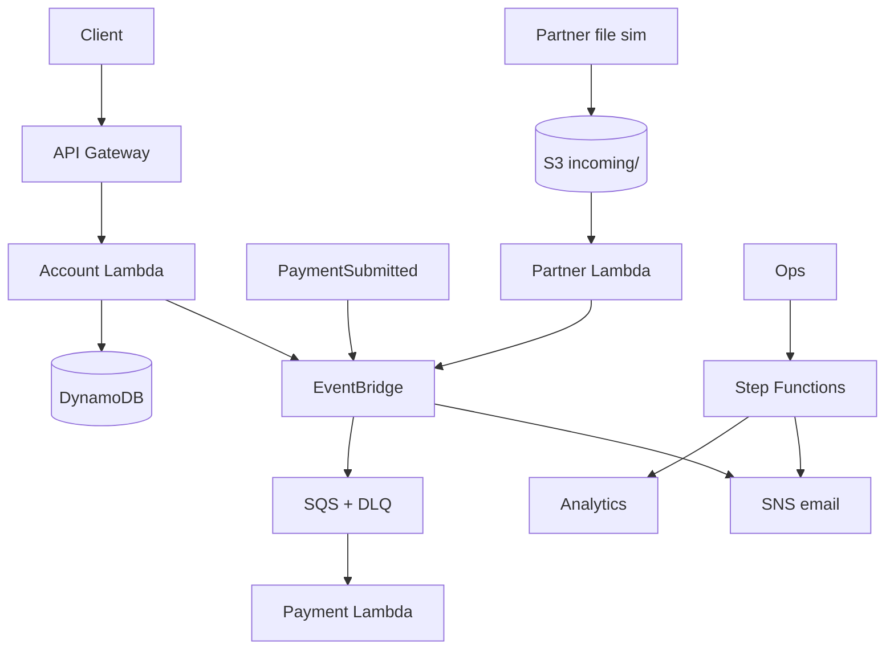

# AWS Lab 06 — Build NorthStar’s Integration Reference Architecture

**Module:** 06 — Integration, Application, and Data Architecture  
**Estimated duration:** 90–120 minutes  
**Estimated cost:** ~<$5 when cleaned up promptly  
**Region recommendation:** us-east-1  
**Case study:** NorthStar Financial Services (fictional)

---

## Cost and safety rules

- Serverless only; no NAT Gateway, always-on EC2, EKS, OpenSearch
- **AWS Transfer Family is conceptual/optional only** — not deployed; continuous endpoints cost money
- Tag all resources; destroy same day
- Confirm SNS email subscription

### Required tags

```text
Project=BayLearn
Course=EnterpriseArchitectureLeadership
Module=06
Student=<student-id>
Environment=Lab
ExpirationDate=<YYYY-MM-DD>
```

---

## 1. Lab title

Build NorthStar’s Integration Reference Architecture

## 2. Business context

NorthStar needs a reference architecture covering:

1. Real-time account APIs  
2. Payment events  
3. Partner SFTP files (simulated via S3)  
4. Regulatory batches  
5. Analytics step  
6. Notifications  

You will deploy the pattern skeleton on AWS and document why each pattern fits.

## 3. Learning objectives

1. Deploy sync, event/queue, file, and workflow patterns
2. Complete pattern matrix and data-flow artifacts
3. Write ADRs including Transfer Family vs S3 landing trade-off

## 4. Architecture diagram



## 5. AWS services

| Service | Purpose | Required? |
| ------- | ------- | --------- |
| API Gateway | Account HTTP API | Yes |
| Lambda | Account, payment, partner, analytics, notify prep | Yes |
| EventBridge | Custom bus + routing | Yes |
| SQS | Payment processing + DLQ | Yes |
| Step Functions | Regulatory batch orchestration | Yes |
| S3 | Partner file landing (SFTP simulation) | Yes |
| DynamoDB | Accounts / payment records | Yes |
| SNS | Notifications | Yes |
| Transfer Family | Real SFTP | **Optional/conceptual — cost warning; not in Terraform** |

## 6–7. Duration and cost

90–120 minutes. See `infrastructure/cost-estimates/lab-06.md`.

## 8. Prerequisites

AWS permissions for listed services; Terraform >= 1.5; AWS CLI; notification email.

## 9. Security warnings

- Do not use production/PII data—use synthetic names only
- Lab APIs are unauthenticated for teaching; never copy this to production as-is
- Partner bucket blocks public access—keep it that way
- Confirm SNS subscription; ignore phishing lookalikes—use AWS console subscription link
- Destroy resources after validation

## 10. Step-by-step implementation

### 10.1 Prepare

```bash
cd infrastructure/terraform/environments/lab06
cp terraform.tfvars.example terraform.tfvars
# set student_id, notification_email, expiration_date
aws sts get-caller-identity
terraform init
terraform plan
```

### 10.2 Deploy

```bash
terraform apply
```

Confirm the SNS subscription email.

### 10.3 Exercise patterns

**A. Real-time account API**

```bash
curl -s -X POST "$(terraform output -raw create_account_url)" \
  -H 'content-type: application/json' \
  -d '{"customer_name":"Ada Lovelace","status":"ACTIVE"}'
```

Save `account_id`, then:

```bash
ACCT=<account_id>
curl -s "$(terraform output -raw accounts_api_endpoint)/accounts/${ACCT}"
```

**B. Payment events**

```bash
aws events put-events --entries "[{
  \"Source\": \"northstar.payments\",
  \"DetailType\": \"PaymentSubmitted\",
  \"EventBusName\": \"$(terraform output -raw event_bus_name)\",
  \"Detail\": \"{\\\"payment_id\\\":\\\"pay-100\\\",\\\"account_id\\\":\\\"${ACCT:-acc-1}\\\",\\\"amount\\\":250.75}\"
}]"
```

Wait ~30s; scan DynamoDB for `PAYMENT#pay-100`.

**C. Partner SFTP simulation**

```bash
echo "partner_id,amount,ccy\\np-9,10.00,USD" > /tmp/partner.csv
aws s3 cp /tmp/partner.csv "s3://$(terraform output -raw partner_bucket_name)/incoming/partner.csv"
```

**D. Regulatory batch + notification**

```bash
aws stepfunctions start-execution \
  --state-machine-arn "$(terraform output -raw state_machine_arn)" \
  --input '{"batch_id":"reg-2026-07-15","source":"lab06"}'
```

Check SNS email after subscription confirmed.

**E. Architecture write-up**

Complete pattern matrix, data-flow diagram, and two ADRs.

## 11. Validation steps

- [ ] Apply succeeded; outputs available
- [ ] POST/GET accounts works
- [ ] Payment event processed (DynamoDB item or Lambda logs)
- [ ] Partner file triggered partner Lambda (CloudWatch logs)
- [ ] Step Functions execution succeeded
- [ ] SNS subscription confirmed (email received or documented pending)
- [ ] Artifacts complete
- [ ] Cleanup done

## 12. Failure scenarios

| Scenario | Observe | Learning |
| -------- | ------- | -------- |
| SNS not confirmed | No email | Delivery path incomplete |
| Poison payment payload | DLQ depth increases after retries | Need DLQ + replay runbook |
| Upload outside `incoming/` | No Lambda trigger | Prefix contracts matter |
| Unauthenticated prod copy | Security incident risk | Lab ≠ production |

## 13. Troubleshooting

| Issue | Check | Fix |
| ----- | ----- | --- |
| API 500 | Account Lambda logs | IAM/env vars; redeploy |
| Payment not processed | Event bus name; SQS metrics; mapping | Fix source/detail-type; check DLQ |
| S3 no invoke | Notification + permission | Re-apply; verify prefix `incoming/` |
| SFN fails on SNS | Subscription / topic policy | Confirm email; check role |

## 14. Submission requirements

- Integration pattern matrix
- Reference architecture diagram
- Data-flow diagram
- ADR-M06-01 and ADR-M06-02
- Validation evidence + cleanup confirmation
- Cost note

## 15. Stretch objectives

See `stretch-objectives.md`.

## 16. Cleanup

```bash
cd infrastructure/terraform/environments/lab06
../../../scripts/cleanup-lab06.sh
```

Confirm no residual `Project=BayLearn` + `Module=06` resources.

## 17. Reference solution

`instructor/reference-solutions/module-06/` (instructor only).
