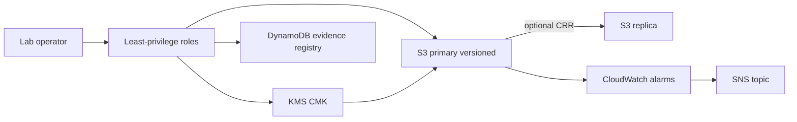

# Lab 07 — Secure and Resilient NorthStar’s Digital Platform

**Module:** 07 — Security, Risk, Compliance, and Resilience  
**Path:** `labs/lab-07-security-resilience/`  
**AWS lab:** Yes  
**Estimated duration:** 90–120 minutes (40 minutes in live session + homework finish)  
**Estimated cost:** Typically **under $3–5 USD** when cleaned up the same day; higher if cross-region replication is left running  
**Recommended region:** `us-east-1` (primary); optional replica region `us-west-2`  
**Case study:** NorthStar Financial Services (fictional)

> **Fiction notice:** NorthStar is fictional. Use only synthetic sample objects—never real customer or payment data.

---

## Cost and safety rules

- Prefer serverless; **avoid NAT Gateway, always-on EC2, EKS, OpenSearch**
- Tag all resources with BayLearn tags
- Create/verify a **budget alert** before deploy
- Run `infrastructure/terraform/scripts/cleanup-lab07.sh` at session end
- Cross-region replication is **optional**—default lab uses versioning + simulated DR runbook to control cost

### Required tags

```text
Project=BayLearn
Course=EnterpriseArchitectureLeadership
Module=07
Student=<student-id>
Environment=Lab
ExpirationDate=<YYYY-MM-DD>
```

---

## Quick links

| Asset | Path |
| ----- | ---- |
| Student instructions | [`student-instructions.md`](student-instructions.md) |
| Submission checklist | [`submission-checklist.md`](submission-checklist.md) |
| Stretch objectives | [`stretch-objectives.md`](stretch-objectives.md) |
| Terraform module | `infrastructure/terraform/modules/security-resilience/` |
| Environment | `infrastructure/terraform/environments/lab07/` |
| Cleanup | `infrastructure/terraform/scripts/cleanup-lab07.sh` |
| Cost estimate | `infrastructure/cost-estimates/lab-07.md` |

---

## Learning objectives (lab)

1. Classify data and draw trust boundaries for the settlement landing-zone slice.
2. Deploy least-privilege IAM, KMS encryption, and S3 versioning via Terraform.
3. Execute a failure/recovery test and record results against RTO/RPO.
4. Produce a control-evidence matrix mapped to real resource identifiers.

---

## Architecture (summary)



---

## Cleanup reminder

```bash
./infrastructure/terraform/scripts/cleanup-lab07.sh
```

Confirm in the console that no lab-tagged buckets, keys, alarms, or tables remain (KMS keys may show PendingDeletion—expected).
