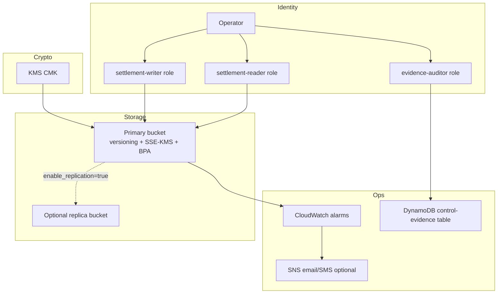

# AWS Lab 07 — Secure and Resilient NorthStar’s Digital Platform

**Module:** 07 — Security, Risk, Compliance, and Resilience  
**Estimated duration:** 90–120 minutes  
**Estimated cost:** <$5 USD when cleaned up promptly (see cost estimate); CRR increases cost  
**Region recommendation:** `us-east-1`  
**Case study:** NorthStar Financial Services (fictional)

---

## Cost and safety rules

- Prefer serverless; avoid NAT Gateway, always-on EC2, EKS, OpenSearch
- Avoid continuously running Transfer Family endpoints
- Tag all resources
- Create/verify a budget alert before deploying
- Run cleanup at the end of the session

### Required tags

```text
Project=BayLearn
Course=EnterpriseArchitectureLeadership
Module=07
Student=<student-id>
Environment=Lab
ExpirationDate=<YYYY-MM-DD>
```

---

## 1. Lab title

Secure and Resilient NorthStar’s Digital Platform

## 2. Business context

NorthStar’s payment settlement files (Restricted) land in cloud object storage. Audit cannot quickly answer who can read them, encryption ownership is unclear, and recovery objectives are untested. As Lead Enterprise Architect, you implement a **reference security/resilience slice**: classify data, threat-model boundaries, deploy least-privilege IAM + KMS + versioned S3, set RTO/RPO, exercise recovery, and produce a control-evidence matrix.

> **Fiction notice:** Synthetic objects only. Do not upload real PII or payment payloads.

## 3. Learning objectives

1. Classify data and document trust boundaries for the platform slice.
2. Implement least-privilege IAM, KMS encryption, S3 versioning (and optional replication or simulated DR).
3. Define RTO/RPO, run a failure/recovery test, and map controls to evidence.

## 4. Architecture diagram



## 5. AWS services

| Service | Purpose | Required? |
| ------- | ------- | --------- |
| IAM | Least-privilege roles/policies | Yes |
| KMS | Customer-managed key for SSE-KMS | Yes |
| S3 | Versioned primary bucket; Block Public Access | Yes |
| S3 CRR | Cross-region replica | Optional — **cost warning:** storage + replication charges |
| CloudWatch | Alarms on delete/error signals | Yes |
| SNS | Alarm notifications | Yes (email subscription optional) |
| DynamoDB | Control-evidence registry (on-demand) | Yes |
| Lambda | Optional helper for drill metadata | Optional — included as lightweight function |

## 6. Estimated duration

Live guided portion ≈ 40 minutes; complete deliverables as homework if needed (total 90–120 minutes).

## 7. Estimated cost

See `infrastructure/cost-estimates/lab-07.md`. Baseline without CRR is typically well under $5 for a same-day lab. **Enable CRR only if you accept extra cost and will clean up the same day.**

## 8. Prerequisites

- AWS account with permissions to manage IAM, KMS, S3, CloudWatch, SNS, DynamoDB, Lambda
- Terraform 1.5+
- AWS CLI v2 configured (`export AWS_PROFILE=...`)
- Budget alarm capability
- Templates: threat model, RTO/RPO worksheet, risk-control matrix

## 9. Security warnings

- Do not use production data or real customer information
- Do not disable Block Public Access
- Do not attach AdministratorAccess to lab roles
- Rotate/destroy lab credentials after cleanup
- KMS keys schedule deletion (default 7–30 days)—expected after destroy

## 10. Step-by-step implementation

### 10.1 Prepare

```bash
cd infrastructure/terraform/environments/lab07
cp terraform.tfvars.example terraform.tfvars
# Edit student_id, alert_email, enable_replication (default false), aws_region
aws sts get-caller-identity
# Verify budget alert exists in Billing console
```

### 10.2 Classify and threat-model (before or in parallel with deploy)

1. Complete data classification for settlement objects, evidence records, and notifications.
2. Draw trust boundaries (use module diagrams as a starting point).
3. Fill STRIDE using `student/templates/10-threat-model.md`.
4. Draft RTO/RPO using `student/templates/11-rto-rpo-worksheet.md` (recommended lab targets: RTO ≤ 4 hours, RPO ≤ 15 minutes for this slice).

### 10.3 Deploy

```bash
cd infrastructure/terraform/environments/lab07
terraform init
terraform plan
terraform apply
terraform output
```

Record outputs: bucket names, KMS key ARN, role ARNs, alarm names, DynamoDB table name.

### 10.4 Configure / exercise

#### A. Least privilege validation

```bash
# Example: assume writer role if your account allows (or use console IAM policy simulator)
# Upload a synthetic object with SSE-KMS
PRIMARY=$(terraform output -raw primary_bucket_name)
KEY=$(terraform output -raw kms_key_arn)
echo "SYNTHETIC settlement record - fictional NorthStar lab $(date -u)" > /tmp/settlement-sample.txt
aws s3 cp /tmp/settlement-sample.txt "s3://${PRIMARY}/settlements/sample-001.txt" \
  --sse aws:kms --sse-kms-key-id "$KEY"
aws s3api head-object --bucket "$PRIMARY" --key settlements/sample-001.txt
```

Confirm server-side encryption is `aws:kms`.

#### B. Versioning / failure and recovery test

```bash
# Create a second version
echo "SYNTHETIC settlement record v2 $(date -u)" > /tmp/settlement-sample.txt
aws s3 cp /tmp/settlement-sample.txt "s3://${PRIMARY}/settlements/sample-001.txt" \
  --sse aws:kms --sse-kms-key-id "$KEY"

# Record start time, then delete current version (simulates accidental destructive change)
START=$(date +%s)
aws s3 rm "s3://${PRIMARY}/settlements/sample-001.txt"

# List versions and restore prior version by copying VersionId back to current
aws s3api list-object-versions --bucket "$PRIMARY" --prefix settlements/sample-001.txt
# Pick a non-delete-marker VersionId from the output, then:
# aws s3api copy-object --bucket "$PRIMARY" --copy-source "${PRIMARY}/settlements/sample-001.txt?versionId=VERSION_ID" \
#   --key settlements/sample-001.txt --sse aws:kms --sse-kms-key-id "$KEY"
END=$(date +%s)
echo "Elapsed seconds: $((END-START))"
```

Document elapsed time vs. your RTO. Note: lab RTO is organizational; the drill measures restore procedure time.

#### C. Optional replication

If `enable_replication = true` in `terraform.tfvars`, verify replica object appearance in the replica region after upload. Then document promotion steps in your DR plan. **If false**, write a **simulated DR plan**: how you would restore from versions, who is paged, and how you would stand up a replacement bucket using Terraform state/outputs.

#### D. CloudWatch alarms

Trigger or inspect alarm configuration for delete/error conditions. Screenshot or CLI-describe the alarm.

```bash
aws cloudwatch describe-alarms --alarm-name-prefix "$(terraform output -raw name_prefix)"
```

#### E. Control-evidence matrix

Write ≥5 rows into your matrix and optionally put a JSON/CSV summary into the DynamoDB evidence table or under `evidence/` prefix using the auditor role pattern described in Terraform outputs.

Suggested columns: Risk | Control objective | Implementation | Evidence (ARN/path) | Owner | Last tested

## 11. Validation steps

- [ ] Bucket has versioning `Enabled` and Block Public Access on
- [ ] Default encryption is SSE-KMS with lab CMK
- [ ] Writer/reader policies are prefix-scoped (no `Resource: "*"` for object ops)
- [ ] Sample object shows KMS encryption
- [ ] Recovery drill completed with timestamps
- [ ] At least one CloudWatch alarm exists and is documented
- [ ] Control-evidence matrix references real ARNs/names from `terraform output`
- [ ] Cleanup plan understood

## 12. Failure scenarios

| Scenario | What to observe | Learning point |
| -------- | --------------- | -------------- |
| Accidental object delete | Delete marker; prior versions remain | Versioning enables RPO-oriented recovery |
| Wrong role / denied GetObject | AccessDenied | Least privilege works when roles are separated |
| Alarm on burst deletes | Alarm state ALARM / insufficient data | Detective controls need signal design |
| CRR misconfigured region | Replication metrics lag/fail | Optional DR adds operational complexity |

## 13. Troubleshooting

| Issue | Check | Fix |
| ----- | ----- | --- |
| AccessDenied on upload | Key policy + IAM allow for `kms:Encrypt` | Ensure role is in key policy; use lab writer role |
| Terraform KMS destroy pending | Key deletion window | Expected; do not schedule shorter than account policy allows |
| Alarm INSUFFICIENT_DATA | Metric not emitted yet | Use drill deletes; document configuration as evidence |
| CRR not appearing | `enable_replication`, replica provider region | Wait a few minutes; verify IAM replication role |
| Budget concern | CRR enabled overnight | Disable CRR / run cleanup immediately |

## 14. Submission requirements

- Trust-boundary diagram + data classification table
- Completed threat model (STRIDE)
- RTO/RPO worksheet + recovery drill notes (timestamps)
- Control-evidence matrix (≥5 controls with evidence paths)
- CLI or screenshot evidence of encryption + versioning
- Cost note + cleanup confirmation (script run + time)

## 15. Stretch objectives

See [`stretch-objectives.md`](stretch-objectives.md).

## 16. Cleanup steps

```bash
# From repo root
./infrastructure/terraform/scripts/cleanup-lab07.sh
# Or manually:
cd infrastructure/terraform/environments/lab07
terraform destroy
```

Empty versioned buckets may require the cleanup script’s purge helper. Confirm in console: no residual lab-tagged resources (except KMS PendingDeletion).

## 17. Reference solution

Instructor-only under `instructor/reference-solutions/module-07/` and Terraform under `infrastructure/terraform/`.
