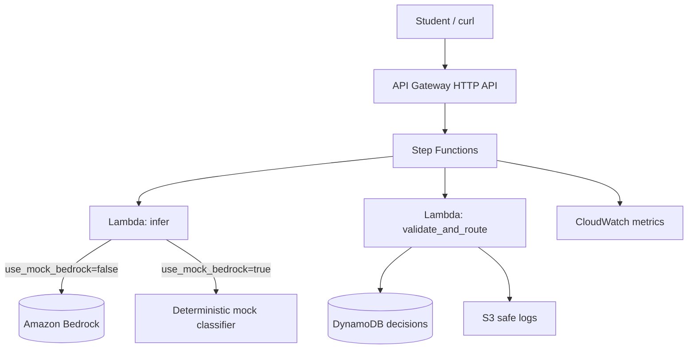

# AWS Lab 08 — Build NorthStar’s Governed AI Decision Assistant

**Module:** 08 — AI Strategy and Intelligent Enterprise Architecture  
**Estimated duration:** 90–120 minutes  
**Estimated cost:** Typically under $5 USD when cleaned up promptly (Bedrock tokens extra if live mode)  
**Region recommendation:** `us-east-1`  
**Case study:** NorthStar Financial Services (fictional)

---

## Cost and safety rules

- Prefer serverless; avoid NAT Gateway, always-on EC2, EKS, OpenSearch
- Tag all resources
- Create/verify a budget alert before deploying
- Run cleanup at the end of the session
- Default to **mock Bedrock mode** until model access is confirmed

### Required tags

```text
Project=BayLearn
Course=EnterpriseArchitectureLeadership
Module=08
Student=<student-id>
Environment=Lab
ExpirationDate=<YYYY-MM-DD>
```

---

## 1. Lab title

Build NorthStar’s Governed AI Decision Assistant

## 2. Business context

NorthStar Incident Response needs faster, more consistent triage. Leadership wants an assistant that, given an incident narrative, proposes:

- category  
- severity  
- business impact  
- routing team  
- next actions  
- whether **HITL** (human-in-the-loop) is required  

As Lead Enterprise Architect, you must prove the use case meets strategy criteria and that the architecture is governed: structured JSON, validation, deterministic rules, safe logging, cost/token tracking, and evaluation—not a raw chatbot.

> **Fiction notice:** Synthetic incidents only.

## 3. Learning objectives

1. Score the use case and document go/conditional-go criteria.
2. Deploy a governed inference pipeline (Bedrock or mock) with validation and HITL routing.
3. Evaluate outputs on the provided dataset and record quality + cost notes.

## 4. Architecture diagram



## 5. AWS services

| Service | Purpose | Required? |
| ------- | ------- | --------- |
| API Gateway | HTTPS entry | Yes |
| Step Functions | Orchestration | Yes |
| Lambda | Infer + validate/route | Yes |
| DynamoDB | Decision records | Yes |
| S3 | Prompts, safe logs, eval artifacts | Yes |
| CloudWatch | Logs + token/cost metrics | Yes |
| Bedrock | Model inference | Optional — enable or use mock |
| Bedrock Guardrails | Extra safety filter | Optional |

## 6. Estimated duration

40 minutes live + homework finish (90–120 total).

## 7. Estimated cost

See `infrastructure/cost-estimates/lab-08.md`. Mock mode is cheapest. Live Bedrock adds token charges.

## 8. Prerequisites

- AWS CLI + Terraform 1.5+
- Budget alert
- Dataset at `labs/lab-08-ai-decision-assistant/datasets/incident-eval-set.csv`
- **Bedrock enablement (live mode only):**

### Bedrock model access steps

1. AWS Console → Amazon Bedrock → Model access (or Model catalog permissions, depending on console version)
2. Request access to the model ID configured in `terraform.tfvars` (default documented in environment README)
3. Wait for **Access granted**
4. Set `use_mock_bedrock = false`
5. Re-apply Terraform
6. If access is denied or delayed, keep `use_mock_bedrock = true` — **the lab still counts**

## 9. Security warnings

- Do not send real customer incident data or PII to Bedrock
- Do not expose the API without the lab’s IAM auth / signed calls as configured (default uses IAM SigV2/SigV4 via IAM permission on HTTP API JWT-less IAM authorizer or execute-api invoke permission—follow environment README)
- Redact logs; do not print secrets
- Destroy resources after class

## 10. Step-by-step implementation

### 10.1 Prepare — use-case criteria

Complete `student/templates/12-ai-use-case-scorecard.md` for the incident assistant. Document HITL stance.

### 10.2 Deploy

```bash
cd infrastructure/terraform/environments/lab08
cp terraform.tfvars.example terraform.tfvars
# Set student_id, expiration_date
# Keep use_mock_bedrock = true unless Bedrock access is confirmed
terraform init
terraform plan
terraform apply
terraform output
```

### 10.3 Structured prompt / JSON contract

The infer Lambda asks for JSON with at least:

```json
{
  "category": "string",
  "severity": "low|medium|high|critical",
  "business_impact": "string",
  "routing_team": "string",
  "next_actions": ["string"],
  "hitl_required": true,
  "confidence": 0.0,
  "rationale": "string"
}
```

Document your prompt changes (if any) in the submission. Prefer small, constrained prompts.

### 10.4 Invoke the assistant

```bash
API=$(terraform output -raw api_endpoint)
# Prefer HTTP API with lab token; Step Functions path also works with IAM.
aws stepfunctions start-execution \
  --state-machine-arn "$(terraform output -raw state_machine_arn)" \
  --input '{"incident_id":"INC-001","incident_text":"Payment authorization API p95 latency above 2s for 15 minutes in us-east-1"}'

# Or HTTP API if invoke URL + auth method printed in outputs
TOKEN=$(terraform output -raw api_token)
curl -s -X POST "$(terraform output -raw api_endpoint)/decisions" \
  -H "Content-Type: application/json" \
  -H "x-lab-token: ${TOKEN}" \
  -d '{"incident_id":"INC-001","incident_text":"Payment authorization API p95 latency above 2s for 15 minutes in us-east-1"}'
```

If curl returns Forbidden, use the Step Functions start-execution path (always available with IAM) and record the execution output.

### 10.5 Validation and deterministic rules

Confirm validate Lambda:

- Rejects missing fields / invalid severity enums (returns validation error path)
- Forces `hitl_required=true` when severity is `high` or `critical`
- Forces HITL when category is `security` or `ai_governance`
- Writes accepted/pending records to DynamoDB

### 10.6 HITL routing

Invoke a Critical case (e.g., INC-005). Confirm DynamoDB item status is `pending_hitl` (or equivalent) and `hitl_required` is true.

### 10.7 Safe logging and token/cost tracking

- Inspect CloudWatch metrics namespace `BayLearn/Lab08` for `InputTokens`, `OutputTokens`, `EstimatedCostUsd` (mock may emit zeros with `Mode=mock`)
- Confirm S3 log objects do not contain fabricated PAN-like strings; lab logger stores redacted payloads

### 10.8 Evaluation dataset

Score at least **10 rows** from `datasets/incident-eval-set.csv` (all 20 encouraged).

Suggested procedure:

1. For each row, start execution with `incident_id` and `incident_text`
2. Compare `routing_team`, `severity`, `hitl_required` to expected columns
3. Compute:
   - routing exact-match rate  
   - severity within-one-level rate  
   - HITL recall for expected_hitl=true  

Write results in your submission (table or CSV).

## 11. Validation steps

- [ ] Scorecard completed with go/conditional-go
- [ ] Terraform apply succeeded; mode (mock/live) recorded
- [ ] At least one successful decision JSON persisted
- [ ] At least one HITL-pending Critical/High case
- [ ] Metrics or log evidence for token/cost (or mock zeros explained)
- [ ] Eval results with quality measure vs threshold
- [ ] Cleanup understood

## 12. Failure scenarios

| Scenario | Observe | Learning |
| -------- | ------- | -------- |
| Bedrock AccessDenied | Infer fails in live mode | Switch to mock; document enablement gap |
| Invalid JSON from model | Validation failure path | Schema gates protect ops |
| High severity without HITL | Should be impossible after rules | Deterministic rules beat model whim |
| Verbose prompt / retries | Token metrics rise | Cost is an architecture concern |

## 13. Troubleshooting

| Issue | Check | Fix |
| ----- | ----- | --- |
| Bedrock AccessDeniedException | Model access in console | Enable model or set mock true and re-apply |
| Step Functions failed | CloudWatch logs for infer/validate | Fix JSON; check IAM |
| curl 401/403 | Auth model on API | Use Step Functions invoke instead |
| Empty eval accuracy | Comparing wrong field names | Use validate output fields |
| Unexpected cost | Live model + many retries | Stop; switch mock; cleanup |

## 14. Submission requirements

- Scorecard + architecture diagram
- Prompt/schema notes + mode (mock/live)
- Evidence of invoke + HITL case
- Evaluation results + quality measure
- Cost/token notes + cleanup confirmation

## 15. Stretch objectives

See [`stretch-objectives.md`](stretch-objectives.md).

## 16. Cleanup steps

```bash
./infrastructure/terraform/scripts/cleanup-lab08.sh
```

Confirm console: no Module=08 lab API, functions, tables, buckets, or state machines remain.

## 17. Reference solution

Instructor-only under `instructor/reference-solutions/module-08/` and Terraform under `infrastructure/terraform/`.
