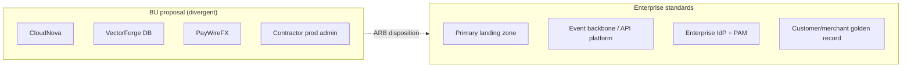

# Lab 09 — Student Instructions

**Module:** 09 — Architecture Governance and Executive Communication  
**Estimated duration:** 90–120 minutes total  
**Case study:** NorthStar Financial Services (fictional)  
**Student role:** Lead Enterprise Architect (submission); ARB role during simulation

---

## 1. Lab title

Conduct an Architecture Review Board on Retail Payments’ divergent proposal.

## 2. Business context

Retail Payments seeks approval for a second cloud, proprietary database, custom integration framework, and standing contractor production access. You must run (or participate in) an ARB and produce a CIO-ready disposition package.

## 3. Learning objectives

1. Apply risk-tiered review to a multi-issue proposal.  
2. Practice role-based constructive challenge.  
3. Produce an executive decision memo and ADRs that record the outcome.

## 4. Architecture diagram

## 5. Prerequisites

- Read [`proposal-pack.md`](proposal-pack.md) and [`arb-simulation-pack.md`](arb-simulation-pack.md)
- Templates: review checklist, ADR, executive memo
- Prior module principles and platform direction notes

## 6. Tasks

1. **Intake:** Complete the architecture review checklist against the proposal pack. Mark missing evidence.  
2. **Role prep:** Write three challenge questions for your assigned ARB role.  
3. **Simulate:** Participate in the live (or study-group) ARB using the agenda in the simulation pack.  
4. **Dispose:** Record Approve / Approve with conditions / Defer / Reject for each of the four requests.  
5. **Document:** Write the executive decision memo and at least two ADRs (cloud and data recommended minimum; access ADR strongly encouraged).  
6. **Offer a path:** Include a feasible alternate approach that protects enterprise standards and still serves merchant outcomes (possibly with a revised date).

## 7. Deliverables

| Deliverable | Format | Capstone link |
| ----------- | ------ | ------------- |
| Completed review checklist | Markdown / PDF | Feeds governance model evidence |
| ARB disposition scorecard + role notes | Markdown | Architecture review participation |
| Executive decision memo | 1–2 pages | Capstone artifact 18 |
| ADRs (≥2; prefer 3) | ADR template | Capstone artifacts 20–24 set |

## 8. Validation steps

- [ ] Each of the four decision requests has an explicit disposition  
- [ ] Conditions (if any) are testable and owned  
- [ ] Memo states a clear ask in business language  
- [ ] ADRs include real alternatives and consequences  
- [ ] Security/resilience impacts are addressed (access, keys, DR, logging)  
- [ ] Alternate path is more than “use standards” slogan—has sequencing

## 9. Common failure scenarios

| Symptom | Likely cause | Recovery |
| ------- | ------------ | -------- |
| Memo says “concerns noted” | No disposition | Force Approve/Cond/Defer/Reject |
| One ADR covers all four asks | Bundling | Split cloud / data / access |
| Reject with no path | Veto theater | Add landing-zone acceleration plan |
| Approve because licenses signed | Sunk-cost fallacy | Separate stoppable vs. sunk spend |

## 10. Troubleshooting

- If your cohort lacks six people, double-role Security+Platform or Data+Delivery.  
- If live simulation is missed, complete an async written ARB using the same scorecard and note assumptions.

## 11. Submission requirements

Upload to BayLearn assignment `module-09`:

- Checklist + scorecard  
- Executive decision memo  
- ADRs  

Naming: `M09_<Artifact>_<LastName>.md` (or PDF)

Use the standard architecture rubric (Module 09 emphasis: trade-offs, security, communication).

## 12. Stretch objectives

See [`stretch-objectives.md`](stretch-objectives.md).

## 13. Templates

- `student/templates/13-architecture-review-checklist.md`  
- `student/templates/01-architecture-decision-record.md`  
- `student/templates/02-executive-decision-memo.md`  
- `student/templates/05-raci-matrix.md`

## 14. Reference solution

Instructor-only: `instructor/reference-solutions/module-09/`
